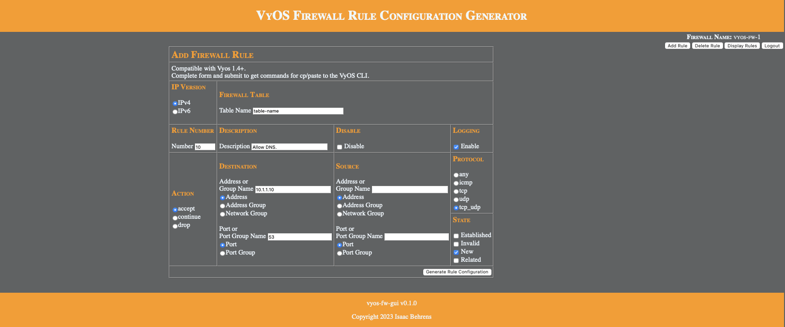

# GUI for creating VyOS firewall rule config commands

The webform generates and displays the syntactically correct configuration commands can then be cp/pasted to the CLI for firewall rule configuration.

Source code: [https://github.com/ibehren1/vyos-fw-gui]( https://github.com/ibehren1/vyos-fw-gui)  
Working demo:  [https://vyosfwgui.behrenshome.com](https://vyosfwgui.behrenshome.com)

## Interface



## Sample Output

```text
#
# Rule 1
#
set firewall ipv4 name table-name rule 1 description 'Rule description.'
set firewall ipv4 name table-name rule 1 action accept
set firewall ipv4 name table-name rule 1 destination address 10.1.1.10
set firewall ipv4 name table-name rule 1 destination port 53
set firewall ipv4 name table-name rule 1 protocol tcp_udp
set firewall ipv4 name table-name rule 1 log
set firewall ipv4 name table-name rule 1 state 'new'
```

## Docker Run

```bash
docker run -p 8080:8080 ibehren1/vyos-fw-gui:amd64
```

## Docker Compose

```yaml
version: '3.7'
services:
  vyos-fw-gui:
    image: ibehren1/vyos-fw-gui:amd64
    container_name: vyos-fw-gui
    ports:
      - 8080:8080/tcp
    restart: unless-stopped
```
