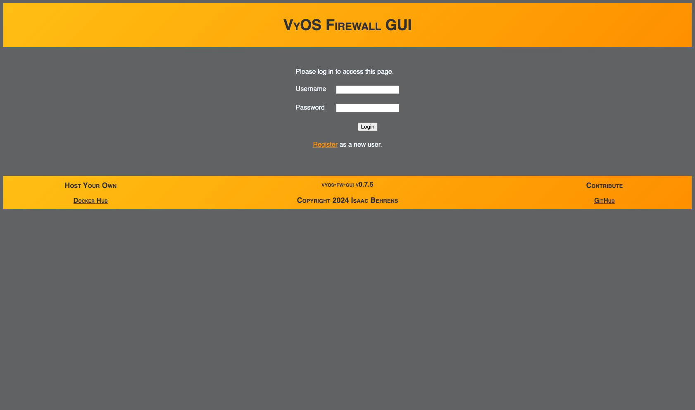
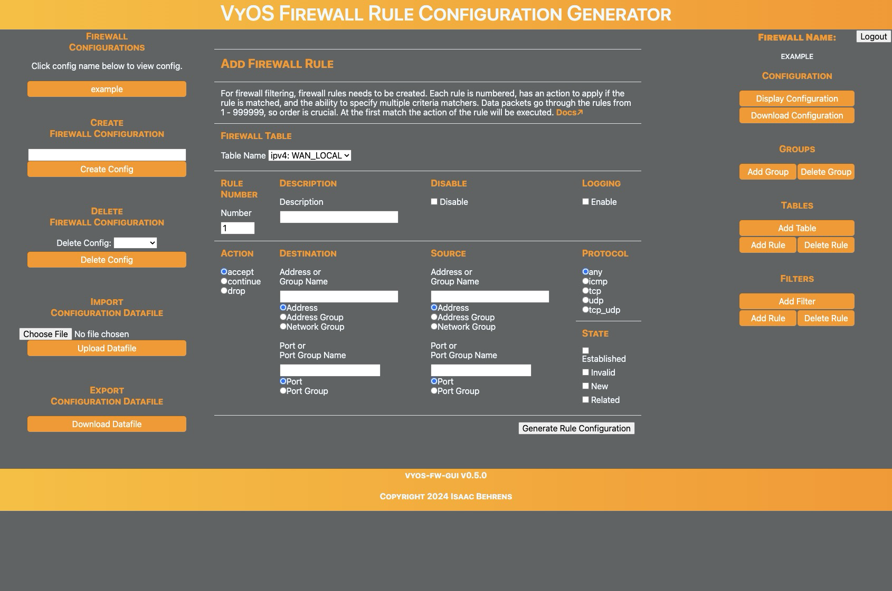
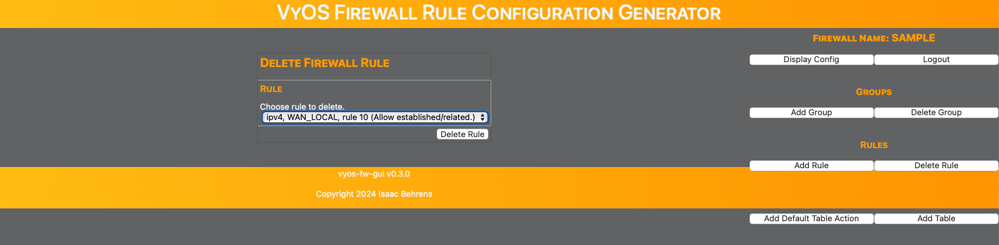

# vyos-fw-gui

## GUI for creating VyOS firewall rule configuration commands

The webform generates and displays the syntactically correct configuration commands can then be cp/pasted to the CLI for firewall rule configuration.

Source code: [https://github.com/ibehren1/vyos-fw-gui]( https://github.com/ibehren1/vyos-fw-gui)  
Docker Hub: [https://hub.docker.com/repository/docker/ibehren1/vyos-fw-gui/general](https://hub.docker.com/repository/docker/ibehren1/vyos-fw-gui/general)  
Working demo:  [https://vyos-fw-gui.com](https://vyos-fw-gui.com)

Close to 1.0.0 release.

## Interface






## Sample Output

```text
#
#
# IPV4
#
#

#
# Groups
#

# Group: DNS_Servers
set firewall group address-group DNS_Servers description 'DNS_Servers'
set firewall group address-group DNS_Servers address '10.53.53.53'

# Group: DNS_Port
set firewall group port-group DNS_Port description 'DNS_Port'
set firewall group port-group DNS_Port port '53'

# Group: SSH_Port
set firewall group port-group SSH_Port description 'SSH_Port'
set firewall group port-group SSH_Port port '22'

# Group: Web_Ports
set firewall group port-group Web_Ports description 'Web_Ports'
set firewall group port-group Web_Ports port '80'
set firewall group port-group Web_Ports port '443'

#
# Filter: input
#
set firewall ipv4 input filter descriptionn 'Input Filter'
set firewall ipv4 input filter default-action 'accept'


# Rule 10
set firewall ipv4 input filter rule 10 description 'WAN LOCAL'
set firewall ipv4 input filter rule 10 action 'jump'
set firewall ipv4 input filter rule 10 inbound-interface 'eth0'
set firewall ipv4 input filter rule 10 jump-target 'WAN_LOCAL'


#
# Filter: forward
#
set firewall ipv4 forward filter descriptionn 'Forward Filter'
set firewall ipv4 forward filter default-action 'accept'


# Rule 10
set firewall ipv4 forward filter rule 10 description 'WAN IN'
set firewall ipv4 forward filter rule 10 action 'jump'
set firewall ipv4 forward filter rule 10 inbound-interface 'eth0'
set firewall ipv4 forward filter rule 10 jump-target 'WAN_IN'


#
# Chain: WAN_LOCAL
#
set firewall ipv4 name WAN_LOCAL default-action 'drop'
set firewall ipv4 name WAN_LOCAL description 'WAN inbound to localhost.'


# Rule 10
set firewall ipv4 name WAN_LOCAL rule 10 description 'Allow established/related.'
set firewall ipv4 name WAN_LOCAL rule 10 action 'accept'
set firewall ipv4 name WAN_LOCAL rule 10 state 'established'
set firewall ipv4 name WAN_LOCAL rule 10 state 'related'

# Rule 20
set firewall ipv4 name WAN_LOCAL rule 20 description 'Drop invalid.'
set firewall ipv4 name WAN_LOCAL rule 20 action 'drop'
set firewall ipv4 name WAN_LOCAL rule 20 log
set firewall ipv4 name WAN_LOCAL rule 20 state 'invalid'

#
# Chain: WAN_IN
#
set firewall ipv4 name WAN_IN default-action 'drop'
set firewall ipv4 name WAN_IN description 'WAN inbound to LAN.'


# Rule 10
set firewall ipv4 name WAN_IN rule 10 description 'Allow established/related.'
set firewall ipv4 name WAN_IN rule 10 action 'accept'
set firewall ipv4 name WAN_IN rule 10 state 'established'
set firewall ipv4 name WAN_IN rule 10 state 'related'

# Rule 20
set firewall ipv4 name WAN_IN rule 20 description 'Drop invalid.'
set firewall ipv4 name WAN_IN rule 20 action 'drop'
set firewall ipv4 name WAN_IN rule 20 log
set firewall ipv4 name WAN_IN rule 20 state 'invalid'

#
#
# IPV6
#
#

#
# Groups
#

# Group: DNS_Servers
set firewall group ipv6-address-group DNS_Servers description 'DNS_Servers'
set firewall group ipv6-address-group DNS_Servers address 'fc00::53'

# Group: DNS_Port
set firewall group ipv6-port-group DNS_Port description 'DNS_Port'
set firewall group ipv6-port-group DNS_Port port '53'

# Group: SSH_Port
set firewall group ipv6-port-group SSH_Port description 'SSH_Port'
set firewall group ipv6-port-group SSH_Port port '22'

# Group: Web_Ports
set firewall group ipv6-port-group Web_Ports description 'Web_Ports'
set firewall group ipv6-port-group Web_Ports port '80'
set firewall group ipv6-port-group Web_Ports port '443'

#
# Filter: input
#
set firewall ipv6 input filter descriptionn 'Input Filter'
set firewall ipv6 input filter default-action 'accept'


# Rule 10
set firewall ipv6 input filter rule 10 description 'WAN LOCAL'
set firewall ipv6 input filter rule 10 action 'jump'
set firewall ipv6 input filter rule 10 inbound-interface 'eth0'
set firewall ipv6 input filter rule 10 jump-target 'WAN_LOCAL'


#
# Filter: forward
#
set firewall ipv6 forward filter descriptionn 'Forward Filter'
set firewall ipv6 forward filter default-action 'accept'


# Rule 10
set firewall ipv6 forward filter rule 10 description 'WAN IN'
set firewall ipv6 forward filter rule 10 action 'jump'
set firewall ipv6 forward filter rule 10 inbound-interface 'eth0'
set firewall ipv6 forward filter rule 10 jump-target 'WAN_IN'


#
# Chain: WAN_LOCAL
#
set firewall ipv6 name WAN_LOCAL default-action 'drop'
set firewall ipv6 name WAN_LOCAL description 'WAN inbound to localhost.'


# Rule 10
set firewall ipv6 name WAN_LOCAL rule 10 description 'Allow established/related.'
set firewall ipv6 name WAN_LOCAL rule 10 action 'accept'
set firewall ipv6 name WAN_LOCAL rule 10 state 'established'
set firewall ipv6 name WAN_LOCAL rule 10 state 'related'

# Rule 20
set firewall ipv6 name WAN_LOCAL rule 20 description 'Drop invalid.'
set firewall ipv6 name WAN_LOCAL rule 20 action 'drop'
set firewall ipv6 name WAN_LOCAL rule 20 log
set firewall ipv6 name WAN_LOCAL rule 20 state 'invalid'

# Rule 30
set firewall ipv6 name WAN_LOCAL rule 30 description 'Allow ICMP.'
set firewall ipv6 name WAN_LOCAL rule 30 action 'accept'
set firewall ipv6 name WAN_LOCAL rule 30 protocol 'ipv6-icmp'

#
# Chain: WAN_IN
#
set firewall ipv6 name WAN_IN default-action 'drop'
set firewall ipv6 name WAN_IN description 'WAN inbound to LAN.'


# Rule 10
set firewall ipv6 name WAN_IN rule 10 description 'Allow established/related.'
set firewall ipv6 name WAN_IN rule 10 action 'accept'
set firewall ipv6 name WAN_IN rule 10 state 'established'
set firewall ipv6 name WAN_IN rule 10 state 'related'

# Rule 20
set firewall ipv6 name WAN_IN rule 20 description 'Drop invalid.'
set firewall ipv6 name WAN_IN rule 20 action 'drop'
set firewall ipv6 name WAN_IN rule 20 log
set firewall ipv6 name WAN_IN rule 20 state 'invalid'

# Rule 30
set firewall ipv6 name WAN_IN rule 30 description 'Allow ICMP.'
set firewall ipv6 name WAN_IN rule 30 action 'accept'
set firewall ipv6 name WAN_IN rule 30 protocol 'ipv6-icmp'
```

## Docker Run

```bash
docker volume create vyos-fw-gui_data

docker run \
  --name   vyos-fw-gui \
  --expose 8080 \
  --mount  source=vyos-fw-gui_data,target=/opt/vyos-fw-gui/data \
  ibehren1/vyos-fw-gui:v0.9.0
```

## Docker Compose

```yaml
version: '3.7'
services:
  vyos-fw-gui:
    image: ibehren1/vyos-fw-gui:v0.9.0
    container_name: vyos-fw-gui
    ports:
      - 8080:8080/tcp
    restart: unless-stopped
    volumes:
      - data:/opt/vyos-fw-gui/data
volumes:
  data:
```
