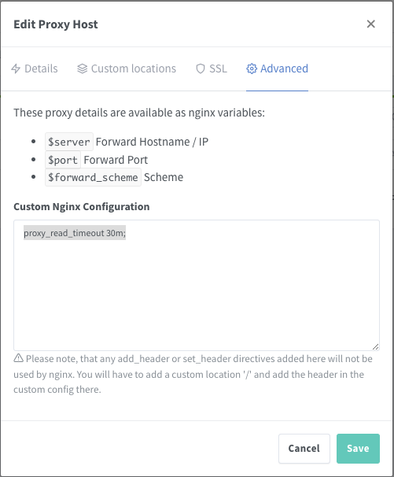
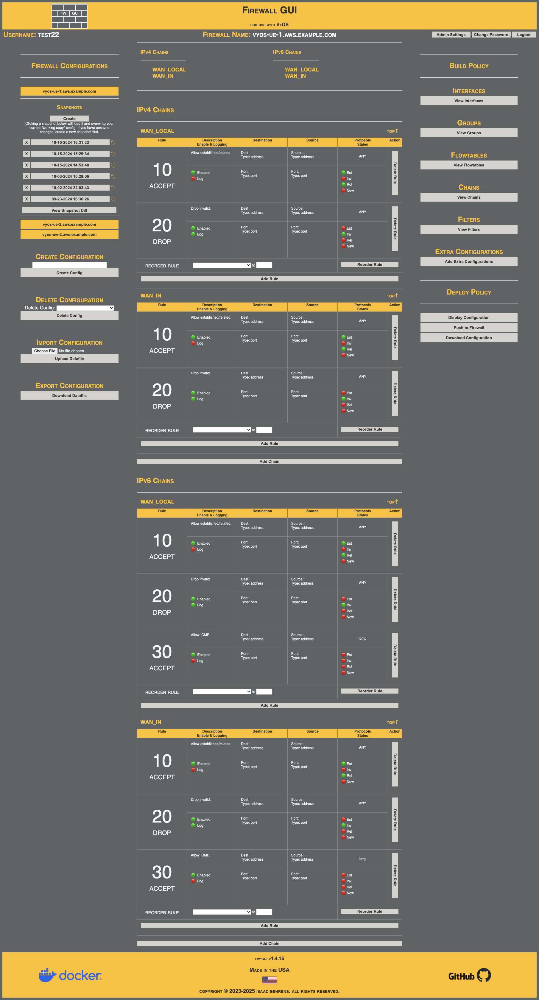
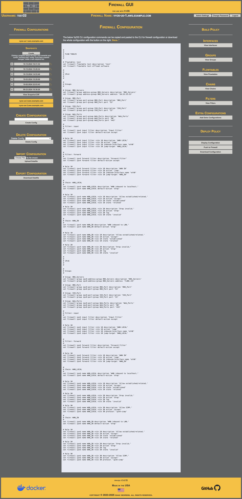

[](https://www.buymeacoffee.com/ibehren1)

# FW-GUI for use with VyOS

The FW-GUI project is not affiliated with VyOS in any way.  It is a wholly separate project to build a community tool that helps to visually build and manage firewall specific configurations for VyOS firewalls.  This project is not owned by VyOS.io, or Sentrium S.L., nor does it seek to appear to be an official project, product or partner of the aforementioned.

## VyOS Version Support

FW-GUI code is created and tested with VyOS 1.4 LTS (Sagitta).

Given the [situation](https://blog.vyos.io/community-contributors-userbase-and-lts-builds) with VyOS project removing the access to the packages repo required to build custom images of VyOS 1.4 in April of 2024, I recommend building custom images via Jenkins as documented here:  https://github.com/dd010101/vyos-jenkins

Consideration of supporting [VyOS Stream](https://blog.vyos.io/introducing-vyos-stream) **_may_** be considered in the future.  
Support of VyOS rolling (current) is unlikely due to the unstable nature of the command line syntax.


## GUI for Managing Firewall Rule Configurations on VyOS Firewalls

The web GUI allows the user to visually create and manage group objects, firewall chains/rules and filter chains/rules for multiple firewalls. Additionally, user can push the created policy to the firewalls via SSH connectivity via the Napalm-VyOS framework or download the configuation commands to apply via console. Additionally, user can import/export a JSON file of the fw-gui configuration to move between instances of the GUI.

| | | |
| - | - | - |
| Source Code |  | [https://github.com/ibehren1/fw-gui](https://github.com/ibehren1/fw-gui)  |
| Docker Hub |  | [https://hub.docker.com/repository/docker/ibehren1/fw-gui/general](https://hub.docker.com/repository/docker/ibehren1/fw-gui/general)  |
| Working Demo |  | [https://fw-gui.com](https://fw-gui.com) |

### Recommended Usage

Deploy via Docker on a server/VM that will be used to manage multiple VyOS Firewall instances.  Use [Nginx Proxy Manager](https://nginxproxymanager.com/) (also via Docker) on the same host to provide LetsEncrypt TLS encrytion between client (web browser) and FW-GUI. Recommend adding `proxy_read_timeout 30m;` as a custom Nginx configuration.



You can also host the FW-GUI as a container on the VyOS device you wish to manage.  Setting up TLS in this case can be provided using [ACME on VyOS](https://docs.vyos.io/en/sagitta/configuration/pki/index.html#acme).

While recommended deployment is via Docker, also inculded in the repo is a systemd service file for use with local install.  

See [Deployment](#deployment) section below for configuration commands.

### Known Issue

When deployed behind HAProxy (VyOS load-balancing reverse-proxy) timeouts can prevent diffs and commits for firewalls with large configurations.  Issue is not obeserved connecting directly to app when hosted in Docker or behind Nginx proxy.

Resolution: TBD

## Commiting to the Firewall

Connections to the firewall are made using the [Napalm-VyOS library](https://github.com/napalm-automation-community/napalm-vyos) via SSH.  Napalm for VyOS only allows merging configurations (changes with existing) and does not allow for replacing configuriations (new replacing existing).  As such, by default, if you remove an item from the config and push, it will not be removed from the firewall as the configs are merged.  To work around this, the View Diffs and Commit interface has the option to preface the firewall configuration with a 'delete firewall' command.  This causes the configuration to remove all firewall configuration and then add the specified configuration settings so that the net configuration is a replacement of the existing configuration.  You will __NOT__ want to use this feature unless you are managing __ALL__ firewall configuations via the GUI.


## Initial Login

There is no initial username and password.  After starting the application, use the "Register as a new user" link to create your username and password.  Once you have registered your user(s), you can disable user registration by updating the environment variable in Docker configuration to `DISABLE_REGISTRATION=True`. Doing this will remove the link to the registration page and stop any POSTS to the route /user_registration from being processed.  This can be reenabled anytime you need to setup users.

Future releases *may* include administration and user management features.

## Backups

You can provide an Amazon S3 bucket name and user credentials as environment variables to enable offsite storage of backups in the S3 bucket.  Backups are created in the Admin Settings page.  Backups are always kept locally and uploaded if the S3 settings are provided.  __Only Amazon S3 is supported.__

## Deployment

### Recommended Deployment -- Docker Compose for combined FW-GUI and Nginx Proxy Manager

```yaml
version: '3.7'
services:
  fw-gui:
    image: ibehren1/fw-gui:latest
    container_name: fw-gui
    environment:
      - APP_SECRET_KEY='This is the secret key.'
      - DISABLE_REGISTRATION=<True|False>
      - BUCKET_NAME=<bucket-name>
      - AWS_ACCESS_KEY_ID=<access-key>
      - AWS_SECRET_ACCESS_KEY=<secret-access-key>
    ports:
      - 8080:8080/tcp
    restart: unless-stopped
    volumes:
      - fwgui-data:/opt/fw-gui/data
  nginx:
    restart: always
    image: 'jc21/nginx-proxy-manager:latest'
    ports:
      - '80:80'
      - '81:81'
      - '443:443'
    environment:
      DB_MYSQL_HOST: "db"
      DB_MYSQL_PORT: 3306
      DB_MYSQL_USER: "npm"
      DB_MYSQL_PASSWORD: "npm"
      DB_MYSQL_NAME: "npm"
    volumes:
      - nginx-data:/data
      - letsencrypt:/etc/letsencrypt
  db:
    restart: always
    image: 'jc21/mariadb-aria:latest'
    environment:
      MYSQL_ROOT_PASSWORD: 'npm'
      MYSQL_DATABASE: 'npm'
      MYSQL_USER: 'npm'
      MYSQL_PASSWORD: 'npm'
    volumes:
      - mysql-data:/var/lib/mysql
volumes:
  fwgui-data:
  nginx-data:
  mysql-data:
  letsencrypt:
```

### Container on VyOS

Run these commands to create the volume for the container and pull the image.

```bash
mkdir -p /config/fw-gui/data
sudo chown -R www-data:www-data /config/fw-gui
add container image ibehren1/fw-gui:latest
```

Run these commands to add the container to the VyOS configuration.

```bash
set container name fw-gui allow-host-networks
set container name fw-gui cap-add 'net-bind-service'
set container name fw-gui description 'FW GUI'
set container name fw-gui image 'ibehren1/fw-gui:latest'
set container name fw-gui environment APP_SECRET_KEY value 'This is the secret key.'
set container name fw-gui environment DISABLE_REGISTRATION value 'False'
set container name fw-gui environment BUCKET_NAME value ''
set container name fw-gui environment AWS_ACCESS_KEY_ID value ''
set container name fw-gui environment AWS_SECRET_ACCESS_KEY value ''
set container name fw-gui port http destination '8080'
set container name fw-gui port http protocol 'tcp'
set container name fw-gui port http source '80'
set container name fw-gui restart 'always'
set container name fw-gui volume fwgui_data destination '/opt/fw-gui/data'
set container name fw-gui volume fwgui_data source '/config/fw-gui/data'
```

### Docker Run

```bash
docker volume create fw-gui_data

docker run \
  --name   fw-gui \
  --expose 8080 \
  --env APP_SECRET_KEY='This is the secret key.' \
  --env DISABLE_REGISTRATION=False \
  --env BUCKET_NAME="" \
  --env AWS_ACCESS_KEY_ID="" \
  --env AWS_SECRET_ACCESS_KEY="" \
  --mount  source=fw-gui_data,target=/opt/fw-gui/data \
  ibehren1/fw-gui:latest
```

### Docker Compose

```yaml
version: '3.7'
services:
  fw-gui:
    image: ibehren1/fw-gui:latest
    container_name: fw-gui
    environment:
      - APP_SECRET_KEY='This is the secret key.'
      - DISABLE_REGISTRATION=False
      - BUCKET_NAME=
      - AWS_ACCESS_KEY_ID=
      - AWS_SECRET_ACCESS_KEY=
    ports:
      - 8080:8080/tcp
    restart: unless-stopped
    volumes:
      - data:/opt/fw-gui/data
volumes:
  data:
```

## Interface




