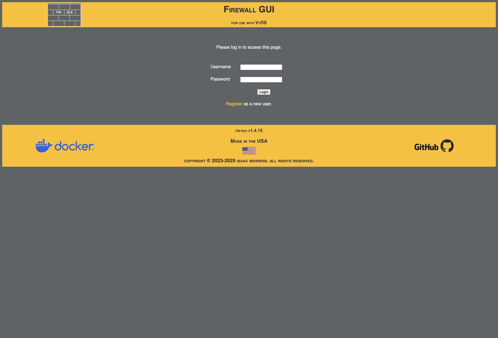

[](https://www.buymeacoffee.com/ibehren1)  
Tell me how you are using FW-GUI! [File a Usage Report](https://github.com/ibehren1/fw-gui/issues/new?assignees=ibehren1&labels=Usage+Information&projects=&template=report-usage-information.md&title=Report+Usage+Information)


# FW-GUI for use with VyOS

The FW-GUI project is not affiliated with VyOS in any way.  It is a wholly separate project to build a community tool that helps to visually build and manage firewall specific configurations for VyOS firewalls.  This project is not owned by VyOS.io, or Sentrium S.L., nor does it seek to appear to be an official project, product or partner of the aforementioned.


# <span style="color:red">*** Breaking Upgrade v1.4.0+ ***</span>

FW-GUI v1.4.0+ uses a separate MongoDB database to store configurations.  As such, you will need to update your deployment to connect to either an external MongoDB database or deploy a second container to host MongoDB.

See [Deployment](#deployment) section below for Docker Compose configuration files.

## VyOS Version Support

FW-GUI code is created and tested with VyOS 1.4 LTS (Sagitta).

Given the [situation](https://blog.vyos.io/community-contributors-userbase-and-lts-builds) with VyOS project removing the access to the packages repo required to build custom images of VyOS 1.4 in April 2024, I recommend building custom images via Jenkins as documented here:  https://github.com/dd010101/vyos-jenkins

Support for [VyOS Stream](https://blog.vyos.io/introducing-vyos-stream) **_may be_** considered in the future.

Support of VyOS rolling (current) is unlikely due to the unstable nature of the command line syntax.


## FW-GUI for Managing Firewall Rule Configurations on VyOS Firewalls

The web-based FW-GUI allows the user to visually:
- Create and manage group objects
- Create and manage firewall chains
- Create and manage filters of chains
- Support for managing multiple firewall configurations
- Create and compare (diff) snapshots of firewall configurations
- Push the created policy configurations to the firewall(s) via SSH connectivity from the web interface
- Import/export a JSON file of the fw-gui configuration for backup and to move between instances of the GUI

(Only manages configurations under 'set firewall' in the command line syntax.)

| | | |
| - | - | - |
| Source Code |  | [https://github.com/ibehren1/fw-gui](https://github.com/ibehren1/fw-gui)  |
| Docker Hub |  | [https://hub.docker.com/repository/docker/ibehren1/fw-gui/general](https://hub.docker.com/repository/docker/ibehren1/fw-gui/general)  |
| Working Demo |  | [https://fw-gui.com](https://fw-gui.com) |

### Recommended Usage

Deploy via Docker on a server/VM that will be used to manage multiple VyOS Firewall instances.  Use [Nginx Proxy Manager](https://nginxproxymanager.com/) (also via Docker) on the same host to provide LetsEncrypt TLS encrytion between client (web browser) and FW-GUI. Recommend adding `proxy_read_timeout 30m;` as a custom Nginx configuration.


See [Deployment](#deployment) section below for configuration commands.

### Known Issue

When deployed behind HAProxy (VyOS load-balancing reverse-proxy) timeouts can prevent diffs and commits for firewalls with large configurations.  Issue is not obeserved connecting directly to app when hosted in Docker or behind Nginx proxy.

Resolution: TBD

## Commiting to the Firewall

Connections to the firewall are made using the [Napalm-VyOS library](https://github.com/napalm-automation-community/napalm-vyos) via SSH.  Napalm for VyOS only allows merging configurations (changes with existing) and does not allow for replacing configuriations (new replacing existing).  As such, by default, if you remove an item from the config and push, it will not be removed from the firewall as the configs are merged.  To work around this, the View Diffs and Commit interface has the option to preface the firewall configuration with a 'delete firewall' command.  This causes the configuration to remove all firewall configuration and then add the specified configuration settings so that the net configuration is a replacement of the existing configuration.  You will __NOT__ want to use this feature unless you are managing __ALL__ firewall configuations via the GUI.


## Initial Login

There is no initial username and password.  After starting the application, use the "Register as a new user" link to create your username and password.  Once you have registered your user(s), you can disable user registration by updating the environment variable in Docker configuration to `DISABLE_REGISTRATION=True`. Doing this will remove the link to the registration page and stop any POSTS to the route /user_registration from being processed.  This can be reenabled anytime you need to setup users.

Future releases *may* include administration and user management features.

## Backups

You can provide an Amazon S3 bucket name and user credentials as environment variables to enable offsite storage of backups in the S3 bucket.  Backups are created in the Admin Settings page.  Backups are always kept locally and uploaded if the S3 settings are provided.  __Only Amazon S3 is supported.__

Access to the backup files is not provided via the web interface as it contains configurations of all users.  Access to the backup is on the Docker host in the FW-GUI volume or via the S3 bucket (if configured).

## Deployment

### Recommended Deployment -- Docker Compose for combined FW-GUI, MongoDB and Nginx Proxy Manager

```diff
+ Lines highlighted in green are the additions for v1.4.0+ to add MongoDB.
```

```diff
version: '3.7'
services:
  fw-gui:
    image: ibehren1/fw-gui:latest
    container_name: fw-gui
+    depends_on:
+     - mongodb
    environment:
      - APP_SECRET_KEY='This is the secret key.'
      - DISABLE_REGISTRATION=<True|False>
+     - MONGODB_URI=mongodb
      - BUCKET_NAME=<bucket-name>
      - AWS_ACCESS_KEY_ID=<access-key>
      - AWS_SECRET_ACCESS_KEY=<secret-access-key>
      - SESSION_TIMEOUT=<number-of-minutes> # Default 120 minutes
    ports:
      - 8080:8080/tcp
    restart: unless-stopped
    volumes:
      - fwgui-data:/opt/fw-gui/data
  nginx:
    restart: always
    image: 'jc21/nginx-proxy-manager:latest'
    ports:
      - '80:80'
      - '81:81'
      - '443:443'
    environment:
      DB_MYSQL_HOST: "db"
      DB_MYSQL_PORT: 3306
      DB_MYSQL_USER: "npm"
      DB_MYSQL_PASSWORD: "npm"
      DB_MYSQL_NAME: "npm"
    volumes:
      - nginx-data:/data
      - letsencrypt:/etc/letsencrypt
  db:
    restart: always
    image: 'jc21/mariadb-aria:latest'
    environment:
      MYSQL_ROOT_PASSWORD: 'npm'
      MYSQL_DATABASE: 'npm'
      MYSQL_USER: 'npm'
      MYSQL_PASSWORD: 'npm'
    volumes:
      - mysql-data:/var/lib/mysql
+ mongodb:
+   container_name: mongodb
+   image: mongo:latest
+   restart: always
+   volumes:
+     - mongo-data:/data/db
+     - mongo-config:/data/configdb
volumes:
  fwgui-data:
  nginx-data:
  mysql-data:
  letsencrypt:
+ mongo-data:
+ mongo-config:
```

### Docker Run

No longer recommended with additional MongoDB container needed.

### Docker Compose Minimal (just FW-GUI and MongoDB no TLS)

```yaml
version: '3.7'
services:
  fw-gui:
    image: ibehren1/fw-gui:latest
    container_name: fw-gui
    depends_on:
      - mongodb
    environment:
      - APP_SECRET_KEY='This is the secret key.'
      - DISABLE_REGISTRATION=False
      - MONGODB_URI=mongodb
      - BUCKET_NAME=
      - AWS_ACCESS_KEY_ID=
      - AWS_SECRET_ACCESS_KEY=
      - SESSION_TIMEOUT=
    ports:
      - 8080:8080/tcp
    restart: unless-stopped
    volumes:
      - data:/opt/fw-gui/data
  mongodb:
    container_name: mongodb
    image: mongo:latest
    restart: always
    volumes:
      - mongo-data:/data/db
      - mongo-config:/data/configdb
volumes:
  data:
  mongo-data:
  mongo-config:
```

## Interface Screenshots




