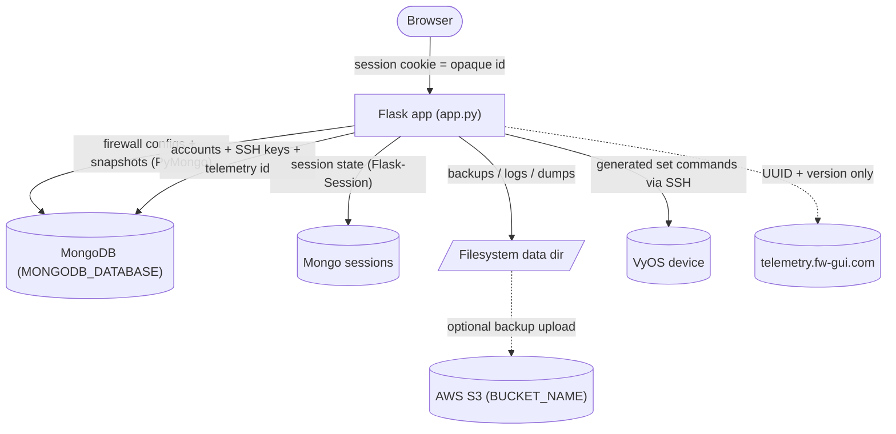
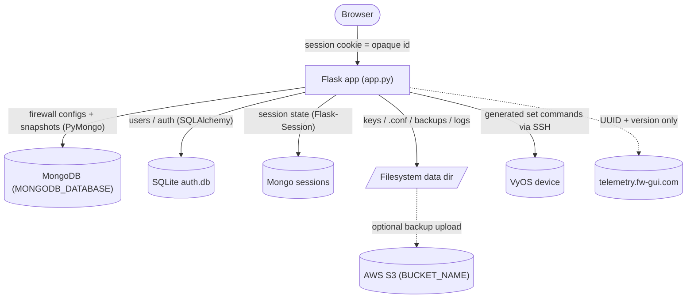
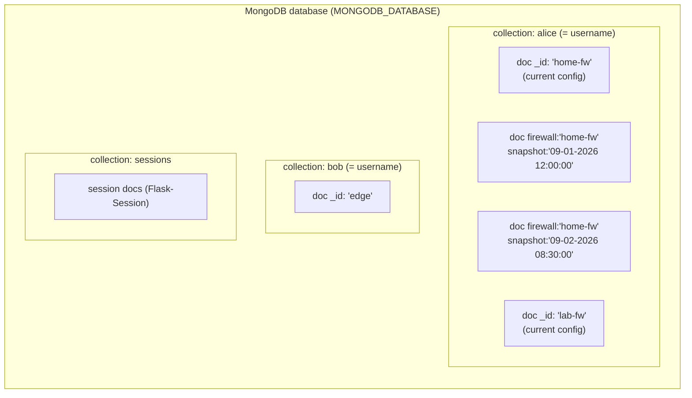
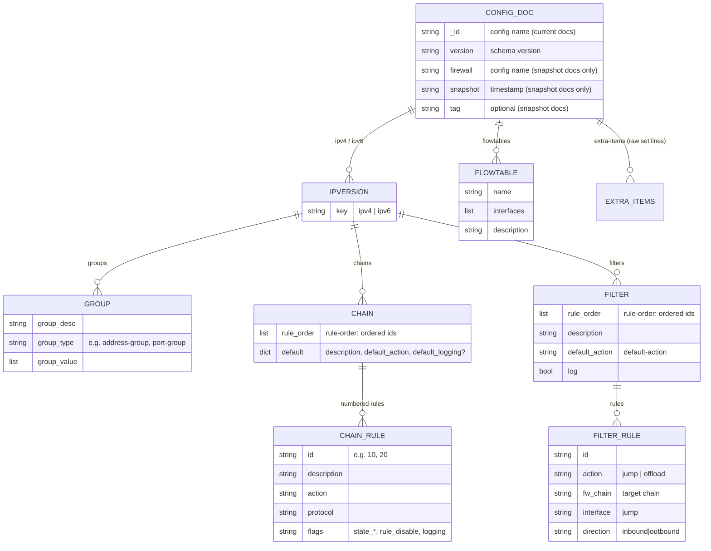
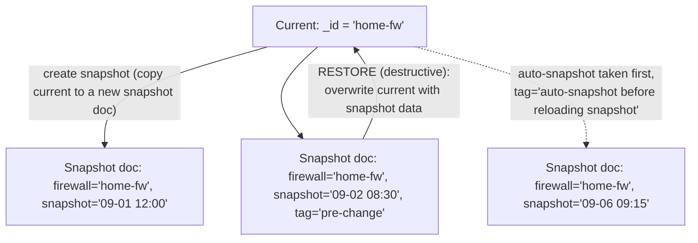
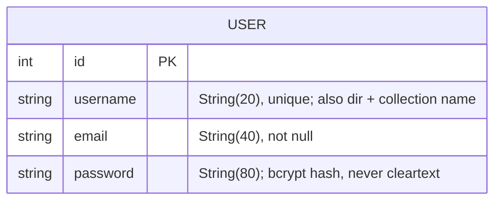
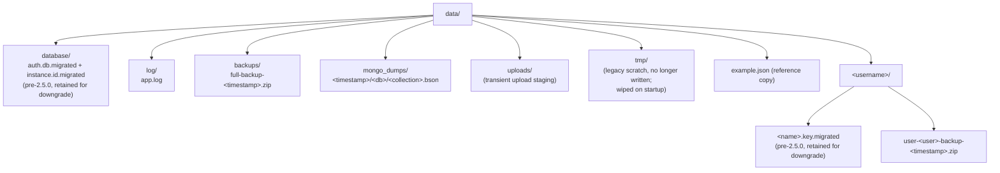
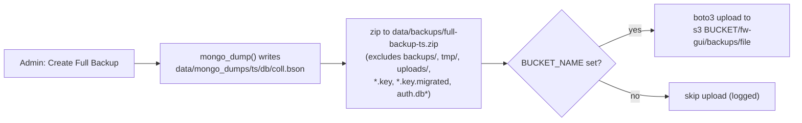
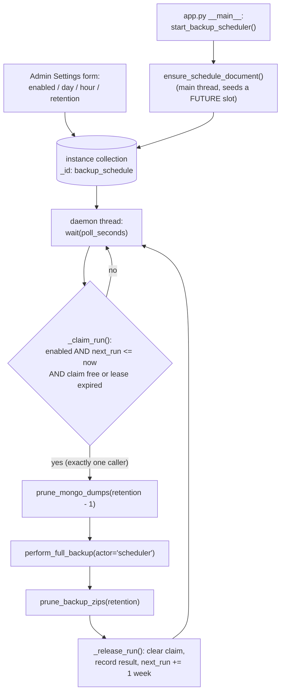
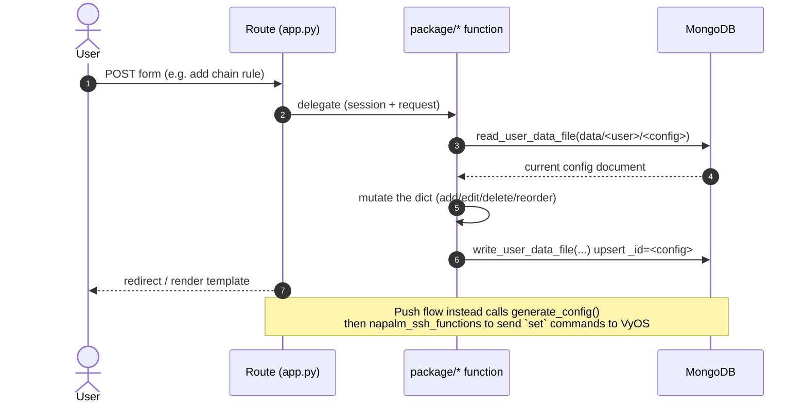

# Data Architecture

How FW-GUI stores and moves data: the databases, the document schema, the
filesystem layout, sessions, backups, and how a request turns into a stored
change. Written for developers and auditors — sections carry `file:line`
references — with diagrams for a quick mental model.

Related: `docs/ssh-credential-handling.md` covers SSH credentials/keys/cookies
in depth; this document covers the overall data model.

**Version note.** Three stores moved into MongoDB in **2.5.0**: user accounts,
previously a SQLite file (`data/database/auth.db`, via Flask-SQLAlchemy);
encrypted SSH keys, previously `data/<user>/<name>.key`; and the telemetry
instance id, previously `data/database/instance.id`. Both eras are documented —
§1, §4 and §10 each carry a `2.5.0+` and a `Pre-2.5.0` subsection — so this
document is usable while running either. Upgrading is automatic and needs no
operator action; see §8 and §10.

The net effect is that `data/` no longer holds durable state or secrets, only
outputs (§6). Each move has its own startup migration (§8.1–8.3), and each
retains the file it replaced rather than deleting it, so downgrading the image
still works (§4, "Downgrading and re-upgrading").

---

## 1. Overview

### 2.5.0+

**Two persistent stores**, one of which also backs the server-side session
store:

| Store | Technology | Holds |
|-------|-----------|-------|
| Application DB | **MongoDB** (PyMongo) | All firewall configs + their snapshots (one collection per user), **plus `users` (accounts), `keys` (encrypted SSH keys) and `instance` (telemetry id)** |
| Session store | **MongoDB** (`sessions` collection, via Flask-Session) | Per-session state; browser holds only an opaque id |
| Filesystem (`data/`) | Local volume | Backups, logs, Mongo dumps — **outputs only, no durable state and no secrets** |



Configuration data, accounts, SSH keys and the telemetry id are all in MongoDB.
The filesystem holds only outputs — backups, logs and Mongo dumps — plus the
retained pre-2.5.0 artifacts on an upgraded install. Decrypted SSH keys are staged
in the system temp directory rather than here, so `data/` holds no secrets.

Consequence worth stating plainly: **MongoDB now holds the credential store.**
The shipped compose files leave MongoDB authentication commented out, justified
by the fact that no port is published and only the fw-gui container shares the
network. Post-2.5.0 anything else attached to that network can read every bcrypt
hash, where previously it would have needed filesystem access inside the fw-gui
container. Enabling MongoDB authentication is correspondingly more worthwhile.

### Pre-2.5.0

**Three persistent stores**, plus a server-side session store:

| Store | Technology | Holds |
|-------|-----------|-------|
| Firewall configuration DB | **MongoDB** (PyMongo) | All firewall configs + their snapshots, one collection per user |
| Auth DB | **SQLite** (Flask-SQLAlchemy) | User accounts (username, email, bcrypt password hash) |
| Session store | **MongoDB** (`sessions` collection, via Flask-Session) | Per-session state; browser holds only an opaque id |
| Filesystem (`data/`) | Local volume | Encrypted SSH keys, generated `.conf` files, backups, logs, Mongo dumps, instance id |



---

## 2. MongoDB — firewall configuration store

### Connection

- Single shared client, lazily created and reused: `_mongo_client` /
  `_get_mongo_client()` → `pymongo.MongoClient(os.environ.get("MONGODB_URI"))`
  (`package/data_file_functions.py:34,78-85`).
- **`serverSelectionTimeoutMS` is 5 s**, not pymongo's 30 s default
  (`SERVER_SELECTION_TIMEOUT_MS`, `:49`), and the Flask-Session client in
  `app.py:242-245` carries the same bound. A database on the same Docker network
  either answers in milliseconds or is not coming, and every stalled request
  holds a waitress thread — a handful of retrying browsers during an outage would
  wedge a finite pool. Measured against a killed MongoDB with the app already
  running: **60.4 s per request before the bound, 10.1 s after** (Flask-Session
  reads on the request and writes on the response, so a request pays the timeout
  twice). `socketTimeoutMS` is deliberately left alone — capping it would kill
  legitimately long queries.
- With `SESSION_TYPE=mongodb` and MongoDB unreachable, `app.py` cannot even be
  imported: Flask-Session's `MongoDBSessionInterface` creates the `expiration` TTL
  index in its constructor. Long-standing behaviour, now surfacing in ~6 s rather
  than ~31 s.
- Database handle from `_get_mongo_db()` (`:88-100`), which every call site uses
  (`:122,366,653,732,788,933,1008,1273`). `MONGODB_DATABASE` defaults to
  `DEFAULT_MONGODB_DATABASE` = `"fwgui_database"` (`:38`), matching the
  session-store default at `app.py:246-248`. The default matters: pymongo raises
  `TypeError: name must be an instance of str` on `client[None]`, and since
  2.5.0 accounts live here too, an unset variable would take the login page down
  rather than only the config routes.
- `validate_mongodb_connection()` (`:1196-1236`) probes at startup and
  `sys.exit()`s on failure, using the same `SERVER_SELECTION_TIMEOUT_MS`. It used
  to pass `serverSelectionTimeoutMS=1`, which is shorter than a real connection
  takes: a mongod that is up but still starting — the normal case behind Compose's
  healthcheck-less `depends_on` — could fail the probe and drop the app into a
  restart loop. In practice the session-store failure above usually fires first.
- No indexes are created by application code. Uniqueness comes from `_id` alone
  (config name per user collection; username in `users`). The TTL index on the
  `sessions` collection is created by Flask-Session, not by this repo.

### Addressing: collection = user, document = config

Throughout the data layer a config is referenced by the string
`data/<username>/<config>[/<snapshot>]`, which is split on `/`:

- `split("/")[1]` → **collection name = username**
- `split("/")[2]` → **document = config (firewall) name**
- `split("/")[3]` (delete only) → **snapshot name**

(`read_user_data_file:929-930`, `write_user_data_file:1269-1270`,
`delete_user_data_file:362-370`.)



- **Current config** = a document whose `_id` is the config name, with **no**
  `firewall`/`snapshot` fields. `list_user_files` finds these with
  `{"firewall": {"$exists": False}, "snapshot": {"$exists": False}}` (`:561-595`).
- **Snapshot** = a separate document in the same collection carrying `firewall`
  (the config name) and `snapshot` (a timestamp string), plus optional `tag`.

### Config document schema

`version` is a schema version (`"0"` legacy → `"1"`; `update_schema:1069-1130`
renamed legacy `tables`→`chains` and `fw_table`→`fw_chain`). `system` is
auto-added on read if missing (`read_user_data_file:948-953`).



Top-level keys: `version`, `ipv4`, `ipv6`, `flowtables` (list of
`{name, interfaces[], description}`), `extra-items` (list of raw VyOS `set`
strings), `interfaces`, `system` (`{hostname, port}`), and on snapshot docs
`firewall`/`snapshot`/`tag`. Under each `ipv4`/`ipv6`: `groups`, `chains`,
`filters` (identical shape for both IP versions).

**Chain rule** (keyed by id directly under the chain; a full match/action rule):

| Field | Meaning |
|-------|---------|
| `description`, `action`, `protocol` | rule basics |
| `dest_address` + `dest_address_type` | `address` or `*_group` |
| `dest_port` + `dest_port_type` | `port` or `port_group` |
| `source_address`/`source_port` (+ `_type`) | same, source side |
| `state_est` / `state_inv` / `state_new` / `state_rel` | presence flags |
| `rule_disable`, `logging` | presence flags |

**Filter rule** (under `filters[name]["rules"][id]`; a thin dispatch rule):
`description`, `action` (`jump` \| `offload`), `fw_chain` (target chain), and for
`jump`: `interface` + `direction`. Optional flags: `log`, `rule_disable`.

---

## 3. Snapshot model

A snapshot is a **separate document in the same per-user collection**, not a
separate collection or a subfield. Current and snapshots of one config coexist:



- **Create** (`create_snapshot`, called by `app.py select_firewall_config`):
  reads current, writes a new doc keyed `{firewall, snapshot=<timestamp>}`.
  Names have one-second granularity and are the only thing identifying a
  snapshot, so `_unique_snapshot_name` steps the timestamp forward a second at a
  time until the name is unused — otherwise the upsert in `write_user_data_file`
  would silently overwrite a snapshot taken in the same second.
- **List** (`list_snapshots`): `{"firewall": <name>, "snapshot": {"$exists": True}}`,
  projected to `snapshot`/`firewall`/`tag` and sorted by `_id` **ascending**
  (creation order, oldest first). The `MM-DD-YYYY HH:MM:SS` name does not sort
  lexicographically, so the name is not usable as a sort key.
- **Restore** (`restore_snapshot`): reads the snapshot non-destructively, then
  **deletes and rewrites the current document** from it — restore is
  **destructive to current**. `select_firewall_config` triggers this, and first
  calls `create_snapshot(..., AUTO_SNAPSHOT_TAG)` so the working copy about to be
  overwritten survives as a snapshot tagged `auto-snapshot before reloading snapshot`.
  Restores are therefore recoverable: load the auto-snapshot to get back.
- **Delete** (`delete_user_data_file`, via the 4th path segment).
- **Tag** (`set_snapshot_tag`, called by `tag_snapshot` from the
  `POST /snapshot_tag` route): a targeted `update_one` on the snapshot document
  that touches **only** the `tag` field — the configuration data is neither read
  nor rewritten, and there is no `upsert`, so a name that does not resolve is a
  no-op. An empty tag `$unset`s the field; "untagged" is the absence of the key,
  never `""`.
- **Diff** reads a snapshot with `diff=True` so current is untouched
  (`package/diff_functions.py`).

### Snapshot-only keys must never reach a current document

`firewall`, `snapshot` and `tag` exist only on snapshot documents
(`_SNAPSHOT_ONLY_KEYS` in `package/data_file_functions.py`). When
`write_user_data_file` writes a `current` document it pops them from the data
**and** `$unset`s them on the stored document; `$set` alone would leave a key
that had already leaked in place permanently. This matters because
`generate_config` walks the document's top-level keys: a `tag` string sitting
next to `ipv4`/`ipv6` used to be treated as an IP version and crashed config
generation with `TypeError: string indices must be integers`. `generate_config`
now also allow-lists `ipv4`/`ipv6` as a second line of defence.

---

## 4. Authentication store

### 2.5.0+ — MongoDB `users` collection

Accounts live in the collection named by `MONGODB_USERS_COLLECTION` (default
`users`) inside `MONGODB_DATABASE`. Access goes through `package/user_store.py`;
`app.py` has no user model.

```
{"_id":       "alice",              # username — the natural key
 "email":     "alice@example.com",
 "password":  "$2b$12$...",         # bcrypt hash, always str
 "disabled":  false,                # absent means enabled
 "legacy_id": 1,                    # rows migrated from SQLite only
 "created":   ISODate(...)}         # new registrations only
```

**`_id` is the username.** That is load-bearing, not incidental:

- Uniqueness is free. No index is created at startup, so there is no index build
  to fail, and `register_user` does not pre-check the name — `create_user()`
  inserts and `DuplicateKeyError` *is* the duplicate check
  (`auth_functions.py:294-306`). The pre-2.5.0 query-then-insert had a window in
  which two simultaneous registrations of one name could both succeed.
- `_id` matching is binary, which preserves exactly the case-sensitive
  uniqueness the SQLite `unique` column gave: `Bob` and `bob` are distinct. No
  collation is set, deliberately — adding one would change semantics and could
  make an existing pair unmigratable.
- The username is immutable identity. Already true in practice: it is also the
  Mongo collection name and the `data/<username>` directory name, and there is
  no rename feature.

**Reserved usernames.** Because a username is a collection name, `users` and
`sessions` are rejected — hardcoded in `validators.py`
(`_RESERVED_USERNAMES` / `is_reserved_username`), matched lowercased and
stripped, and honoured *in addition to* whatever `MONGODB_USERS_COLLECTION` is
set to. A user holding one of those names would be handed an application
collection as their config collection, and the ordinary config routes would then
let them list, read and delete other users' accounts or session documents.
`is_valid_username()` calls the guard, so every caller inherits it, and the
startup migration refuses to boot if a legacy account already holds such a name.

**Disabling, not deleting.** There is no delete-user feature, by design. Removing
a document would free the username, and the next person to register it would
inherit the previous holder's configs, snapshots and SSH keys. Disable instead:

```javascript
db.users.updateOne({_id: "alice"}, {$set: {disabled: true}})
```

The field is `disabled` rather than `enabled` so that an absent value means
usable — documents predating the field keep working. It is enforced in three
places, because checking only at login would leave an already-authenticated
session alive: `process_login` before `login_user()`
(`auth_functions.py:172-181`), `get_user_by_session_id` used by the `user_loader`
(`user_store.py:83-95`, so disabling takes effect on the user's *next request*),
and `change_password` (`auth_functions.py:84-90`, so a disabled account cannot
rotate its way back in). `User.is_active` returns `not disabled`, which
Flask-Login consults in `login_user()`, as a fourth free layer. A refused login
flashes the same "Login incorrect." as a bad password — saying "disabled" would
hand out account enumeration — and logs a WARNING with the username.

**Session token.** `get_id()` returns `u:<username>`
(`user_store.SESSION_ID_PREFIX`), not the bare name: `is_valid_username` permits
all-digit usernames, so an unprefixed token would be indistinguishable from the
integer primary key that pre-2.5.0 sessions carry, and a stale session holding
`"1"` could resolve to the account *named* `1`.

Passwords are hashed with Flask-Bcrypt and stored as `str` — both write paths
`.decode("utf-8")` the bytes `generate_password_hash()` returns
(`auth_functions.py:113,213`). `_password_matches()` (`:38-52`) traps the
`ValueError` bcrypt raises on an empty or malformed stored hash, so such an
account fails its login instead of 500ing the login page.

Queries deliberately do not swallow exceptions: a MongoDB outage must not be
rendered as "no such user".

### Pre-2.5.0 — SQLite `auth.db` (historical)

`User` model in `app.py`, a Flask-SQLAlchemy + Flask-Login `UserMixin`:



- File: `sqlite:////{db_location}/auth.db` where
  `db_location = os.path.join(os.getcwd(), "data/database")` → `data/database/auth.db`.
  Created via `db.create_all()` if missing, from `initialize_data_dir()`.
- The `password` column holds a **mix of TEXT and BLOB**:
  `generate_password_hash()` returns bytes and neither write path decoded it, so
  what a row contains depends on which code path created it. The 2.5.0 migration
  normalises both to `str`.

After upgrading, the file is retained as `data/database/auth.db.migrated` (see
§8.1). Nothing reads it; it exists only so that downgrading the image still has
accounts. It is excluded from backup zips, since it is a full set of bcrypt
hashes that would otherwise travel to S3.

### Downgrading and re-upgrading

**Procedure.** Stop the app, rename the file back, then start the pre-2.5.0
image:

```bash
docker compose stop fw-gui
mv data/database/auth.db.migrated data/database/auth.db
# switch the image tag back, then
docker compose up -d fw-gui
```

The order matters. Pre-2.5.0 `initialize_data_dir()` runs `db.create_all()` when
`auth.db` is absent, so starting the old image first leaves you with an empty
database — no accounts and an open registration page — which then has to be
overwritten and the container restarted.

**What the downgrade costs.** `auth.db.migrated` is a point-in-time snapshot
taken at the cutover, and the old code knows nothing about the fields 2.5.0
added:

- **Disabled accounts become active again.** Pre-2.5.0 has no `disabled`
  concept and never reads the field, so anyone disabled in 2.5.0 regains access.
- Accounts created after the cutover are **not in the file at all** — those users
  lose access entirely.
- Passwords changed after the cutover **revert to their pre-cutover value**,
  including one rotated precisely because it leaked.
- Everyone is logged out once. Sessions hold `_user_id = "u:<username>"`, which
  matches no integer primary key, so the old `load_user` returns `None` and the
  request is redirected to the login page. Not an error, just a re-login.
- `POST /download` comes back (§6).

Firewall configs and snapshots are unaffected — the authentication move did not
touch their documents, so the old image reads exactly the same data.

**Re-upgrading afterwards needs a decision.** The `users` collection stays in
MongoDB for the whole downgraded period, and the migration's `$setOnInsert`
(§8.1) means an existing MongoDB document always wins. So a plain re-upgrade
**keeps the MongoDB state and discards everything changed while downgraded** —
password changes and disables included; only users who are genuinely new to
MongoDB get inserted. The migration logs a WARNING naming every account it
skipped for this reason, which on a first-ever migration never appears.

That default is deliberate: quietly overwriting live accounts from a stale
SQLite file would be the worse mistake. To re-upgrade from the SQLite state
instead, drop the collection first so the migration repopulates it from scratch:

```javascript
db.users.drop()
```

Be clear about what that costs, though — it makes SQLite the whole truth, so it
reintroduces the downgrade's own losses: **every account created after the
original cutover disappears** (they were only ever in MongoDB), and **every
disabled account is enabled again** (SQLite has no such field). Prefer it only
when the changes made while downgraded outweigh those.

**Where the rollback data lives: the volume, not a backup.** Full-backup zips
taken after the cutover exclude `auth.db*` and carry `mongo_dumps/.../users.bson`
instead, so they cannot serve a downgrade. If the volume's `auth.db.migrated` is
gone, there is no rollback path.

**Rename `<name>.key.migrated` back too.** 2.5.0 also moved encrypted SSH keys
into MongoDB (`docs/ssh-credential-handling.md` §3) and retired `data/<user>/<name>.key` the same way. Without the
rename the old code finds no keys and the user must re-upload, getting a new
Fernet key:

```bash
for f in data/*/*.key.migrated; do mv "$f" "${f%.migrated}"; done
```

**Rename `instance.id.migrated` back too.** 2.5.0 also moved the telemetry
instance id into MongoDB (§10) and retired `data/database/instance.id` the same
way. A downgrade that leaves the file renamed will have the old code mint a fresh
UUID, so the install reports to telemetry as a brand new one. Harmless to the
application either way, but it breaks continuity in the maintainer's counts:

```bash
mv data/database/instance.id.migrated data/database/instance.id
```

---

## 5. Session store

Flask-Session stores session state **server-side**; the browser cookie holds
only an opaque, signed session id (`app.py:221-245`).

- `SESSION_TYPE` (env, default `mongodb`) → collection `sessions` in the same
  Mongo database (`SESSION_MONGODB*`). Tests use `filesystem`.
- Keys: `data_dir`, `username`, `firewall_name`, `hostname`, `port`, `ssh_user`,
  `ssh_pass` (**Fernet-encrypted at rest**, `encrypt_secret`/`decrypt_secret`,
  `app.py:248-274`), `ssh_keyname`, `_user_id`.
- `_user_id` is Flask-Login's token. **2.5.0+:** `u:<username>`. **Pre-2.5.0:**
  the SQLite integer primary key as a string. The formats are disjoint on
  purpose (§4).
- Cookie hardening: `HTTPONLY=True`, `SAMESITE=Lax`, `SECURE` opt-in via env.
- Lifetime: `SESSION_PERMANENT=True` honoring `PERMANENT_SESSION_LIFETIME`
  (from `SESSION_TIMEOUT`, default 120 min). Logout deletes the session doc; a
  TTL index on `expiration` reaps expired ones. (Details in
  `docs/ssh-credential-handling.md`.)
- **The 2.5.0 upgrade clears the session store once** — every document in the
  `sessions` collection and every file in `flask_session/` — because the
  `_user_id` format changed. Everyone is logged out at the cutover instead of
  holding a token that cannot resolve.

---

## 6. Filesystem layout (`data/`)

Created by `initialize_data_dir()` (`data_file_functions.py:452-526`):



- Per-user dir `data/<username>/` created on first login (`auth_functions.py:218-233`);
  path stored in the session as `data_dir`.
- `data/tmp/` is created and cleared on every startup (`:507-514`), but **nothing
  writes to it as of 2.5.0** — decrypted SSH keys are staged in the system temp
  directory instead (see below). The wipe is kept so an upgraded install does not
  keep a pre-2.5.0 plaintext key that a hard kill left behind.
- Nothing in the app serves arbitrary files out of `data/`. The `POST /download`
  route, which read any path under `data/` for any logged-in user, was removed
  in 2.5.0; it had no caller in the UI. The two real download endpoints,
  `/download_config` and `/download_json`, build their response from the
  session's own config and take no caller-supplied path.
- **No durable state and no secrets are here as of 2.5.0.** Firewall configs, user
  accounts, SSH keys and the telemetry id are all in MongoDB. What remains is
  outputs — `backups/`, `log/`, `mongo_dumps/` — plus the retained pre-2.5.0
  artifacts on an upgraded install (`auth.db.migrated`, `instance.id.migrated`,
  `<name>.key.migrated`) and a per-user dir that now holds only user backup zips.
- Decrypted SSH keys are staged in the **system temp directory**, not under
  `data/`, so a plaintext private key never touches this volume
  (`ssh_key_store.decrypt_ssh_key()`; see `docs/ssh-credential-handling.md`).
- The `<name>.key.migrated` files are excluded from backups: the live ciphertext
  already arrives via `keys.bson` in the Mongo dump, so the on-disk copy would be
  a redundant second copy of the same secret.
- `sweep_legacy_user_files()` (`:529-586`) removes two kinds of leftover from the
  per-user dir on the first startup after upgrade, both of which earlier releases
  created and never deleted, and both of which shipped in every full-backup zip:
  - `<firewall_name>.conf` — the generated set commands, written on every push
    purely to give NAPALM a file path. NAPALM is now handed the commands as a
    string (`build_merge_config`), so nothing writes or reads them.
  - `<name>.old` — a JSON config already imported into MongoDB by
    `mongo_converter` (§8.3). Safe to delete because the rename happens only
    after the write succeeds, so a `.old` file means that config *is* in
    MongoDB.

  `.json` is deliberately not swept: `mongo_converter` still imports those. The
  sweep is bounded to real account directories rather than a `data/*/*` glob, and
  is self-limiting — after the first run the globs are empty, so there is no
  marker file.

---

## 7. Backups



- `create_backup(session, user=False)` (`data_file_functions.py:225-301`): runs
  `mongo_dump()` (`:767-798`), zips `data/` **excluding** `backups/`, `tmp/`,
  `uploads/`, any `*.key` or `*.key.migrated`, and `auth.db*` (`:257-274`), then
  `upload_backup_file()`.
- `mongo_dump()` sweeps `list_collection_names()`, so since 2.5.0 every dump
  includes `users.bson` — the full bcrypt hash set — and `keys.bson`, every user's
  Fernet-encrypted SSH key. Both are deliberate: a backup that restored neither
  accounts nor keys would be of limited use. The key blobs are defensible in an
  archive only because the Fernet passphrase is never stored server-side
  (`docs/ssh-credential-handling.md` §3), so a leaked zip yields ciphertext nobody
  can decrypt.
- The same reasoning drives two exclusions. The retained pre-2.5.0 `auth.db*` and
  `*.key.migrated` files are skipped because the live copy of each secret already
  arrives via the dump, and a second copy on the way off the host buys nothing.
  It is also why the `POST /download` route was removed (§6): the zips were
  in-app readable by any logged-in user.
- **The admin page states this.** "Create Full Backup" says the archive includes
  the MongoDB dump and that encrypted SSH keys are in it. It previously claimed
  keys were *excluded* — true of the on-disk `.key` files the zip walk skips, but
  wrong once the ciphertext moved into `keys.bson`.
- **A manual backup prunes nothing.** `data/mongo_dumps/` keeps a timestamped
  directory per backup **and every zip re-archives all of them**, so both the
  directory count and each successive archive grow without bound. A real install
  reached 944 MB of archives across 18 zips and 119 dump directories this way.
  The scheduled backup (§7.1) is what bounds this; for manual-only use,
  housekeeping remains an operator task.
- S3 (`upload_backup_file:1133-1193`): env `BUCKET_NAME`, `AWS_ACCESS_KEY_ID`,
  `AWS_SECRET_ACCESS_KEY`; skipped if `BUCKET_NAME` unset; key prefix
  `fw-gui/backups/`.
- **No in-app restore**: backups are created/uploaded/listed only. Retrieving a
  backup zip is an out-of-band operation (filesystem or S3) — as of 2.5.0 there
  is no in-app download for it — and there is no automated restore path in the
  code.

### 7.1 Scheduled backups (`backup_scheduler.py`, 2.5.0)



**The document is the only configuration.** There are no environment variables;
the Admin Settings page writes `enabled`, `day_of_week`, `hour` and `retention`,
and every read goes through `settings_from_document()`, which defaults and clamps
each field. That is deliberate on two counts: one source of truth needs no
precedence rule between a variable and a stored value, and a setting that lives in
the database takes effect without a restart and survives a container replacement.
`poll_seconds` and `lease_seconds` are stored too but kept off the form — tuning
with no user-visible effect, and a field inviting a 30-second poll would only add
load.

- **The claim, not the thread, provides the safety.** `app.run(debug=True)` runs
  `__main__` in both the reloader parent and the child, and the Helm chart can
  scale past one replica, so "one thread per process" is not "one backup per
  week". `_claim_run()` is a single `find_one_and_update`; MongoDB applies updates
  to one document serially, so exactly one caller's filter matches and the rest
  get `None`.
- **The claim does not advance `next_run`; `_release_run()` does.** If claiming
  consumed the week, a process killed mid-zip would silently skip the backup
  entirely. Instead the claim is recovered by the lease (`lease_seconds`, default
  1 h): `claimed_at` stays set and `next_run` stays due, so after the lease expires
  whoever next polls retries the same window. The lease must exceed the longest
  plausible backup.
- **`next_run` advances on failure too.** A failing backup that kept its slot
  would retry every poll interval, writing and deleting archives every five
  minutes. One attempt per week, with `last_result`/`last_error` visible on the
  Admin page, is the intended cadence.
- **Catch-up coalesces.** `next_run` is an absolute timestamp compared with
  `$lte`, so an instance down for three weeks finds one overdue slot, backs up
  once, and jumps to the next future slot — `_release_run()` computes it from
  `max(now, stored next_run)`. Three identical stale backups would be waste.
- **First boot never backs up.** `ensure_schedule_document()` seeds `next_run` to
  a future slot and uses `$setOnInsert`, so a restart cannot re-seed it. Adding a
  multi-GB zip to the boot that already runs four migrations (§8) would make an
  upgrade look hung, and it would prune a never-pruned install at the worst
  moment.
- **Startup never overwrites a saved setting.** `ensure_schedule_document()` writes
  every field with `$setOnInsert`, so it seeds a fresh install and is otherwise a
  no-op — a restart cannot undo what an administrator chose. `$setOnInsert` rather
  than find-then-insert so two processes starting together converge on one document
  instead of racing.
- **`update_settings()` recomputes `next_run` when the day or hour moves, and also
  when the schedule is switched on.** The second half matters as much as the first:
  a schedule left off for a month holds a long-past `next_run`, so without
  recomputing, enabling it would fire a backup — and a prune — seconds after the
  click rather than at the hour just chosen. Re-saving an unchanged schedule leaves
  the slot alone, so it does not drift a week later each time someone hits Save.
- **Form values are clamped, not rejected.** They arrive from a `<select>` and a
  number input, so anything out of range is a hand-made POST or a browser quirk;
  there is no useful error to show for it, and refusing the whole save would
  discard the fields that were fine. A value that cannot be parsed at all keeps
  the stored one, so a mangled field cannot silently move the schedule.
- **Retention prunes at both ends, for different reasons.** Dumps are pruned to
  `retention - 1` *before* `mongo_dump()`, because every zip re-archives whatever
  is in `data/mongo_dumps` — pruning first is what actually bounds the new
  archive's size, and the fresh dump then brings the count to exactly `retention`.
  Archives are pruned to `retention` *after* the zip is in place, so a failed
  backup does not leave the set one short.
- **Pruning sorts by mtime, not by the timestamp in the name.** The names come
  from `str(datetime.now())`, which is naive *local* time: at the end of DST a
  genuinely newer directory gets a name that sorts earlier, and pruning by name
  would delete the newest backup. `mongo_dump()` and `perform_full_backup()` also
  compute their timestamps independently, so a zip and its own dump can straddle a
  second boundary. The basename is only a tiebreaker.
- **Archives are matched with `endswith(".zip")`**, deliberately unlike
  `list_full_backups()`'s `".zip" in file`: the pruner deletes what it matches, and
  the looser test also matches names like `notes.zip.bak`. A `realpath`
  containment check guards the `shutil.rmtree`, so a symlinked dump directory
  cannot redirect a recursive delete out of `data/mongo_dumps`.
- **S3 is never pruned.** Offsite copies exist to survive mistakes made on this
  host, so the app must not be able to delete its own offsite history; it would
  also need a wider IAM grant than put-only. Decisively, the key is
  `fw-gui/backups/<filename>` with **no instance identifier**, so two instances
  sharing a bucket share the prefix and a per-instance prune would delete the
  other's archives. Operators should use an S3 lifecycle rule.
- **`perform_full_backup()` is the request-free core.** `create_backup()` remains
  the wrapper that turns the outcome into flash messages; the scheduler cannot
  use it because `flash()` and `session` need a request. The zip is staged in
  `data/tmp` and moved with `os.replace`, so a process killed mid-zip cannot leave
  a truncated `full-backup-*.zip` that `list_full_backups()` would report as real.
  `upload_backup_file()`'s success flash is guarded with `has_request_context()`
  for the same reason.
- **Upgrade impact.** A new schedule is seeded disabled, so an upgrade changes
  nothing but the Admin Settings page. Enabling it on an install that has never
  pruned would delete hundreds of dumps hours later in a background thread, so
  saving the form reports the exact counts `prune_preview()` computes at the moment
  of consent, and the same counts are logged before the first deletion. Setting
  **Backups to keep** to `0` schedules backups with no deletion at all. On such an
  install the *first* scheduled archive is already the small one, because dumps are
  pruned before the dump runs.
- **The thread starts regardless of `enabled`**, provided MongoDB is reachable;
  `enabled` is enforced in the claim filter so the toggle needs no restart. It is
  started from `__main__` only — never at module scope, which would spawn a thread
  in every pytest run and in any WSGI import of `app`. It is a daemon thread with
  an `atexit` stop hook: the event makes a normal shutdown prompt, and the daemon
  flag guarantees a container SIGTERM is not blocked by an in-progress zip.

---

## 8. Startup migrations

Four steps run from `app.py`'s `__main__` block, all inside the MongoDB
connection check:

```python
if validate_mongodb_connection(os.environ.get("MONGODB_URI")):
    migrate_sqlite_users()
    accounts = list_usernames()
    migrate_legacy_key_files(accounts)
    sweep_legacy_user_files(accounts)
    mongo_converter()
```

**The order is load-bearing, in both directions.**

- `migrate_sqlite_users()` is first because everything after it is driven by
  `list_usernames()`. On a pre-2.5.0 upgrade the accounts are still in SQLite at
  this point, so calling it earlier would return an empty list and silently adopt
  no keys and sweep no files.
- `sweep_legacy_user_files()` runs **before** `mongo_converter()`, not after,
  because the converter is what *creates* the `.old` files (§8.3). Reversing them
  would delete a file written seconds earlier, discarding the one-restart safety
  net it exists to provide.
- None of it can move into `initialize_data_dir()`, which runs earlier — that is
  before MongoDB is known to be reachable, and all three of these need the
  account list.

On a database that cannot be reached, every step is skipped and retried on the
next successful boot. `initialize_data_dir()` still runs, so the directory
structure exists either way.

### 8.1 SQLite accounts → MongoDB (`user_migration.py`, 2.5.0)

No operator action required.

1. Return immediately if `data/database/auth.db` is absent — a fresh install, or
   one already migrated.
2. Abort (CRITICAL + exit) if the target collection already holds documents with
   no `password` field: it is some user's config collection, and
   `MONGODB_USERS_COLLECTION` needs to point somewhere else.
3. Read the accounts from SQLite over a read-only `file:` URI (so no `-wal`
   /`-shm` sidecars appear beside a database the app otherwise no longer opens),
   querying `FROM user` — SQLAlchemy's implicit table name. An unreadable or
   corrupt file is logged and skipped **without** renaming, so the next boot
   retries.
4. Abort (CRITICAL + exit) if any legacy username is reserved (§4). The operator
   has to rename the account.
5. For each row, normalise the hash to `str` (the column holds a TEXT/BLOB mix)
   and upsert with **`$setOnInsert`**. Rows with no username or no password are
   skipped with a warning.
6. Purge the session store (§5).
7. Rename `auth.db` → `auth.db.migrated`. An existing `auth.db.migrated` is never
   overwritten — it is an earlier migration's rollback snapshot — so the new one
   gets a timestamp suffix instead.

**Why `$setOnInsert` and not `$set`.** The rename is the marker, and a marker on
a volume is not trustworthy: restore `data/` from an older snapshot and the
migration runs again. With `$set` that re-run would restore every user's
pre-cutover password hash — including one deliberately rotated because it
leaked — and re-enable an account the operator had since disabled. With
`$setOnInsert` a second run is a no-op on accounts that already exist.

`process_login()` also calls `migrate_sqlite_users()`, guarded by the same
missing-file check. `app.py` is the shipped entrypoint, but a WSGI server
(`gunicorn app:app`) never runs its `__main__` block, and every account would
appear to have vanished.

To re-run deliberately, rename `auth.db.migrated` back to `auth.db` and restart.
Note what a re-run does **not** do: accounts already present in MongoDB are left
exactly as they are (that is `$setOnInsert`), so this recovers accounts that
failed to migrate rather than re-syncing the ones that succeeded. See
"Downgrading and re-upgrading" in §4.

### 8.2 On-disk SSH keys → MongoDB (`ssh_key_store.py`, 2.5.0)

`migrate_legacy_key_files(usernames)` adopts pre-2.5.0 `data/<user>/*.key` files.
No operator action required. `docs/ssh-credential-handling.md` §3 covers the key
lifecycle; this is the migration mechanics only.

1. For each account, glob `data/<user>/*.key` (`glob.escape` on the username, so a
   name with a glob metacharacter cannot widen the match).
2. Read the ciphertext. An empty file is skipped with a warning — storing a zero
   byte blob would mask the loss behind a key that exists but cannot decrypt.
3. Upsert with **`$setOnInsert`** under `_id` = `"<user>/<name>"`, `name` being the
   filename with `.key` removed, plus `migrated_from_file: True` as a provenance
   marker.
4. Rename the file to `<name>.key.migrated`. An existing `.migrated` is never
   overwritten; the new one gets a timestamp suffix, exactly as with `auth.db`.

Same `$setOnInsert` reasoning as §8.1, and it matters more here: on a re-run
against a restored `data/` volume, `$set` would overwrite a key the user has since
re-uploaded — replacing a working key with ciphertext whose passphrase they no
longer have, unrecoverably, since the server never held it.

The file is **renamed, never deleted**. That ciphertext is the user's only copy,
and the retained file is the downgrade path (§4, "Downgrading and re-upgrading").
A failure anywhere in the loop is logged and leaves the file unrenamed, so the
next boot retries it; the migration never raises, because a key that will not
adopt must not stop the application from starting.

**Only accounts in the `users` collection are visited.** A pre-2.5.0 user whose
account never reached MongoDB — not present in `auth.db` at migration time, so
never created — keeps its `.key` files on disk unadopted and cannot use key
authentication until the account exists. The files are untouched, so this is
recoverable: create the account, restart, and they are adopted.

### 8.3 On-disk JSON configs → MongoDB (`mongo_converter.py`, 1.4.0)

One-shot startup migration of pre-1.4.0 on-disk JSON configs:

1. Get the user list from `user_store.list_usernames()` (disabled accounts
   included, so their leftover JSON still imports). Pre-2.5.0 this was
   `SELECT username FROM User` against `auth.db`.
2. For each user, find `data/<user>/*.json`.
3. `json.loads` each, drop `_id`, `write_user_data_file(...)` (inserts a current
   config doc).
4. Rename the file to `<name>.old` so it isn't re-imported. Note the ordering:
   the rename is *after* the write, so a `.old` file always means the config
   reached MongoDB — a failed write leaves the file as `.json` to be retried on
   the next boot.

No-op when no leftover `.json` files exist. Uploaded JSON takes the same
`write_user_data_file` path via `process_upload`.

The `.old` file is a one-restart safety net, not a permanent copy:
`sweep_legacy_user_files()` (§6) deletes it, and runs *before* this converter on
each startup so that a file created by this boot survives until the next one.

It walks per-user directories rather than globbing `data/*/*.json` on purpose:
the glob would match `data/uploads/*.json`, the transient upload staging area,
and import a stray upload into a collection named `uploads`.

---

## 9. Request → storage data flow



Matches the documented flow in `CLAUDE.md`: HTTP → route → package function →
`read_user_data_file` → mutate → `write_user_data_file` → render/redirect.

---

## 10. Telemetry

Sends **only** an instance UUID and the app version to
`https://telemetry.fw-gui.com/<route>` (`/instance`, `/commit`, `/diff`,
`/rule_usage`) via urllib3 (`telemetry_functions.py`). No config or user data is
transmitted, and every failure is swallowed.

### 2.5.0+ — the `instance` collection

`package/instance_id.py` owns the id. One document, in the collection named by
`validators.INSTANCE_COLLECTION`:

```
{"_id": "instance_id", "value": "<uuid4>", "created": ISODate(...)}
```

Since 2.5.0 that collection also holds the weekly backup schedule as a second
fixed document, `_id: "backup_schedule"` (§7.1). The two do not interact:
`instance_id` looks its value up by `_id`, so the schedule document is invisible
to it, and neither is a new reserved username.

`get_or_create_instance_id()` resolves in order:

1. **`FWGUI_INSTANCE_ID`**, if set — returned immediately, without touching
   MongoDB. Used by CI to tag its runs, and available to pin one identity across
   a blue/green replacement.
2. **A process-level cache.** `get_instance_id()` fires on every telemetry event
   — login, commit, diff, rule usage — and used to be a free file read; without
   the cache each event would be a round trip. Only a non-empty value is cached,
   so a transient outage does not pin `""` for the life of the process.
3. **MongoDB**, seeded lazily on first use with `$setOnInsert` + a read-back, so
   two concurrent callers converge on one value rather than racing.

Seeding lives in the getter rather than in `initialize_data_dir()` on purpose: it
removes any startup-ordering coupling and works under a WSGI entrypoint that
never runs `app.py`'s `__main__`.

`instance` is a reserved username (§4) — a username is also a collection name, so
otherwise a user could be handed this collection as their config collection. The
collision is *not* auth-critical, so unlike `users`/`sessions` it does not abort
the startup migration; `instance_id.py` logs an ERROR and telemetry degrades.

**Two invariants, both mutation-tested:**

- **Nothing in `instance_id.py` raises.** `telemetry_commit()` and
  `telemetry_diff()` are called from `napalm_ssh_functions.py:128` and `:199`
  *outside* the try blocks that guard a firewall push, so an escaping exception
  would turn a telemetry lookup into a failed commit. An unavailable id is `""`.
- **The lookup is time-bounded** by `pymongo.timeout(2.0)`, tighter than the
  shared client's 5 s (§2) because this used to be a free file read and
  `telemetry_instance()` is in the login path. Four telemetry calls against an
  unreachable database measured 121 s against pymongo's bare 30 s default, 8 s
  with the bound.

`telemetry_instance()` runs *after* `validate_mongodb_connection()` in `app.py`'s
`__main__`, so it has a real id and cannot stall the boot. Consequence: an install
that cannot reach MongoDB used to post here and then exit, so it reported; it now
dies silently.

### Pre-2.5.0 — `data/database/instance.id`

A random `uuid.uuid4()` written once by `initialize_data_dir()` and read back with
a plain `open()`. On upgrade the value is **adopted** so the install keeps its
telemetry identity, then the file is renamed to `instance.id.migrated` — retained
for the same reason as `auth.db.migrated`, and cleaned up with it. Retiring the
file is best effort: the id is already stored and the stored value wins on every
later read, so a read-only data directory costs a leftover file, not the id.

---

## 11. Data-related environment variables

| Variable | Purpose |
|----------|---------|
| `MONGODB_URI` | MongoDB connection string (configs, accounts, SSH keys, telemetry id, sessions) |
| `MONGODB_DATABASE` | Mongo database name (default `fwgui_database`) |
| `MONGODB_USERS_COLLECTION` | Collection holding user accounts (default `users`, 2.5.0+). Escape hatch for an install that already has a user of that name |
| `FWGUI_INSTANCE_ID` | Pins the telemetry instance id instead of reading it from MongoDB (2.5.0+). Unset for normal use |
| `APP_SECRET_KEY` | Signs the session id; derives the cached-secret encryption key |
| `SESSION_TYPE` | Session backend (`mongodb` default; `filesystem` for tests) |
| `SESSION_TIMEOUT` | Session lifetime in minutes (default 120) |
| `SESSION_COOKIE_SECURE` | Send session cookie over HTTPS only (opt-in) |
| `BUCKET_NAME`, `AWS_ACCESS_KEY_ID`, `AWS_SECRET_ACCESS_KEY` | Optional S3 backup upload |

**The scheduled backup has no environment variables** (§7.1). Its enabled state,
day, hour, retention, poll interval and claim lease all live on the
`backup_schedule` document and are edited on the Admin Settings page. That is one
source of truth rather than two: a variable and a stored value that disagreed
would need a precedence rule, and whichever lost would look like a bug to whoever
set it. It also means the settings survive a container replacement and take effect
without a restart — the opposite trade-off from `SESSION_TIMEOUT` and friends,
which are process configuration read once at start.

**Only the accounts collection is renameable.** `keys`, `instance` and `sessions`
are fixed (`validators.KEYS_COLLECTION`, `INSTANCE_COLLECTION`, and
`SESSION_MONGODB_COLLECT` in `app.py`); `MONGODB_USERS_COLLECTION` exists because
an install upgrading from SQLite could already have a *user* named `users`, whose
config collection would then be the account store. All four names are rejected as
usernames (§4), so the collision cannot be created after the fact — the escape
hatch is only for one that predates 2.5.0. `MONGODB_USERS_COLLECTION` is honoured
*in addition to* the hardcoded names, never instead of them, so pointing it
elsewhere does not make `users` claimable.
