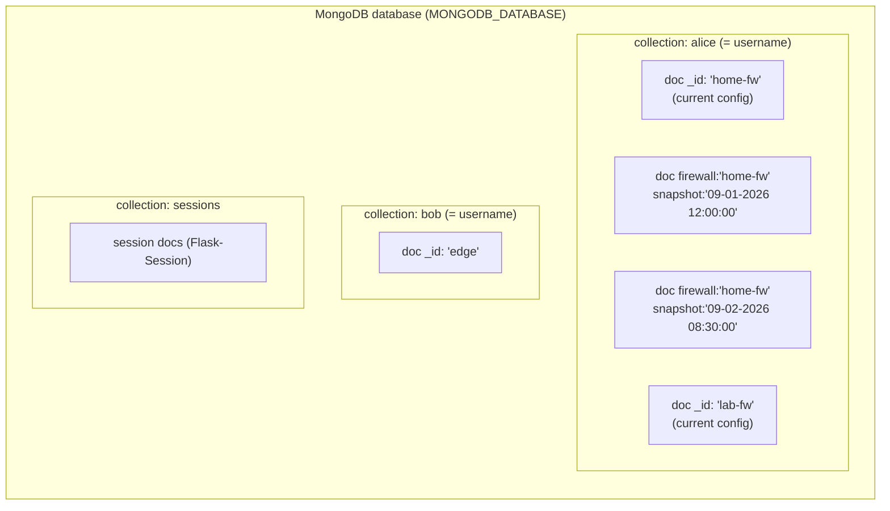
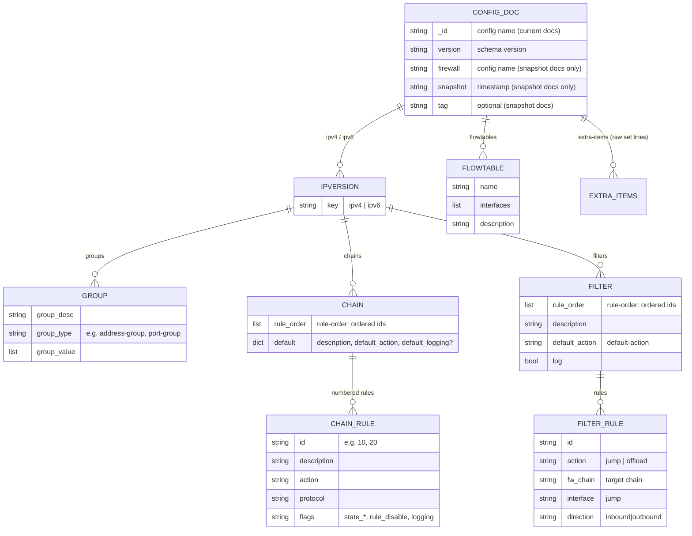
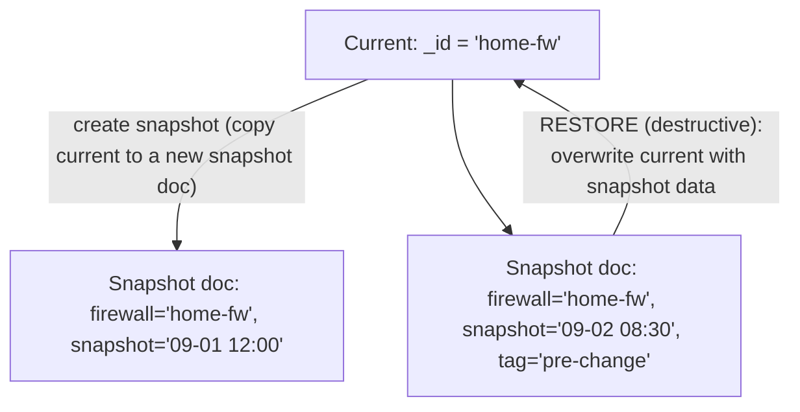
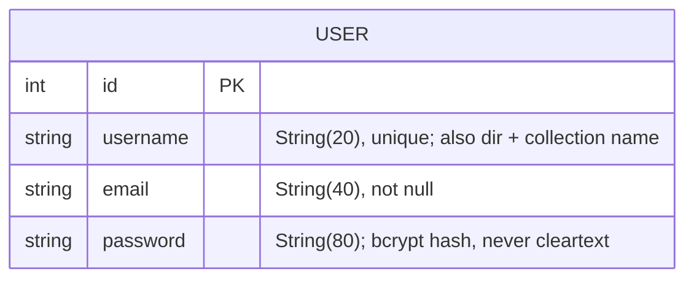
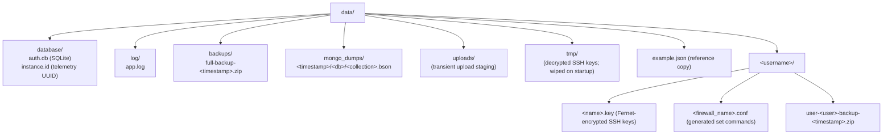
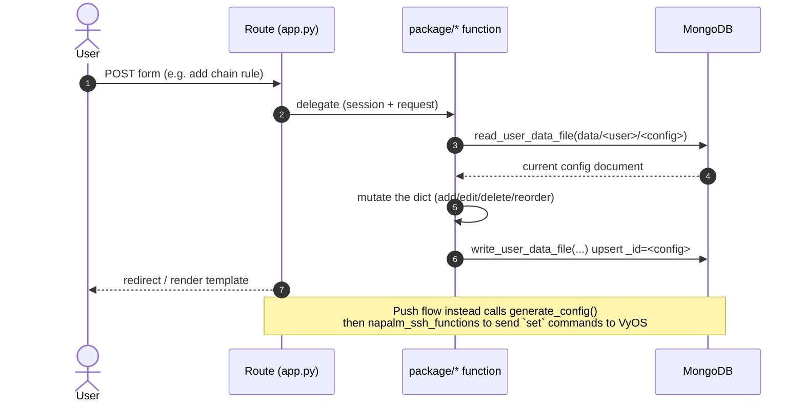

# Data Architecture

How FW-GUI stores and moves data: the databases, the document schema, the
filesystem layout, sessions, backups, and how a request turns into a stored
change. Written for developers and auditors — sections carry `file:line`
references — with diagrams for a quick mental model.

Related: `docs/ssh-credential-handling.md` covers SSH credentials/keys/cookies
in depth; this document covers the overall data model.

---

## 1. Overview

FW-GUI uses **three persistent stores**, plus a server-side session store:

| Store | Technology | Holds |
|-------|-----------|-------|
| Firewall configuration DB | **MongoDB** (PyMongo) | All firewall configs + their snapshots, one collection per user |
| Auth DB | **SQLite** (Flask-SQLAlchemy) | User accounts (username, email, bcrypt password hash) |
| Session store | **MongoDB** (`sessions` collection, via Flask-Session) | Per-session state; browser holds only an opaque id |
| Filesystem (`data/`) | Local volume | Encrypted SSH keys, generated `.conf` files, backups, logs, Mongo dumps, instance id |

Configuration data lives in **MongoDB**, not on disk — the per-user filesystem
directory holds only keys, generated command files, and backups.

---

## 2. MongoDB — firewall configuration store

### Connection

- Single shared client, lazily created and reused: `_mongo_client` /
  `_get_mongo_client()` → `pymongo.MongoClient(os.environ.get("MONGODB_URI"))`
  (`package/data_file_functions.py:35,38-42`).
- Database selected everywhere as `client[os.environ.get("MONGODB_DATABASE")]`
  (e.g. `:276,509,586,795,1098`). Default `"fwgui_database"` is applied only in
  the session config (`app.py:227-229`); **the data-layer calls pass no default**,
  so `MONGODB_DATABASE` must be set.
- `validate_mongodb_connection()` (`:995-1027`) probes with
  `serverSelectionTimeoutMS=1` and `sys.exit()`s on failure at startup.

### Addressing: collection = user, document = config

Throughout the data layer a config is referenced by the string
`data/<username>/<config>[/<snapshot>]`, which is split on `/`:

- `split("/")[1]` → **collection name = username**
- `split("/")[2]` → **document = config (firewall) name**
- `split("/")[3]` (delete only) → **snapshot name**

(`read_user_data_file:790-801`, `write_user_data_file:1093-1116`,
`delete_user_data_file:271-287`.)

- **Current config** = a document whose `_id` is the config name, with **no**
  `firewall`/`snapshot` fields. `list_user_files` finds these with
  `{"firewall": {"$exists": False}, "snapshot": {"$exists": False}}` (`:561-595`).
- **Snapshot** = a separate document in the same collection carrying `firewall`
  (the config name) and `snapshot` (a timestamp string), plus optional `tag`.

### Config document schema

`version` is a schema version (`"0"` legacy → `"1"`; `update_schema:868-929`
renamed legacy `tables`→`chains` and `fw_table`→`fw_chain`). `system` is
auto-added on read if missing (`read_user_data_file:810-815`).

Top-level keys: `version`, `ipv4`, `ipv6`, `flowtables` (list of
`{name, interfaces[], description}`), `extra-items` (list of raw VyOS `set`
strings), `interfaces`, `system` (`{hostname, port}`), and on snapshot docs
`firewall`/`snapshot`/`tag`. Under each `ipv4`/`ipv6`: `groups`, `chains`,
`filters` (identical shape for both IP versions).

**Chain rule** (keyed by id directly under the chain; a full match/action rule):

| Field | Meaning |
|-------|---------|
| `description`, `action`, `protocol` | rule basics |
| `dest_address` + `dest_address_type` | `address` or `*_group` |
| `dest_port` + `dest_port_type` | `port` or `port_group` |
| `source_address`/`source_port` (+ `_type`) | same, source side |
| `state_est` / `state_inv` / `state_new` / `state_rel` | presence flags |
| `rule_disable`, `logging` | presence flags |

**Filter rule** (under `filters[name]["rules"][id]`; a thin dispatch rule):
`description`, `action` (`jump` \| `offload`), `fw_chain` (target chain), and for
`jump`: `interface` + `direction`. Optional flags: `log`, `rule_disable`.

---

## 3. Snapshot model

A snapshot is a **separate document in the same per-user collection**, not a
separate collection or a subfield. Current and snapshots of one config coexist:

- **Create** (`app.py select_firewall_config:1911-1923`): reads current, drops
  `tag`, writes a new doc keyed `{firewall, snapshot=<timestamp>}`.
- **List** (`list_snapshots:478-525`): `{"firewall": <name>, "snapshot": {"$exists": True}}`.
- **Restore** (`read_user_data_file:817-821`): with a named snapshot and
  `diff=False`, it **deletes and rewrites the current document** from the
  snapshot — restore is **destructive to current**. `select_firewall_config`
  triggers this at `:1908`.
- **Delete** (`delete_user_data_file:279-281`, via the 4th path segment).
- **Tag** (`tag_snapshot:828-865`): reads snapshot with `diff=True` (non-destructive)
  and writes back a `tag`.
- **Diff** reads a snapshot with `diff=True` so current is untouched
  (`package/diff_functions.py:51-54`).

---

## 4. SQLite — authentication database

`User` model (`app.py:270-287`), a Flask-SQLAlchemy + Flask-Login `UserMixin`:

- File: `sqlite:////{db_location}/auth.db` where
  `db_location = os.path.join(os.getcwd(), "data/database")` → `data/database/auth.db`
  (`app.py:166,193`). Created via `db.create_all()` if missing
  (`initialize_data_dir` → `data_file_functions.py:430-435`).
- Passwords hashed with Flask-Bcrypt at registration (`auth_functions.py:264-267`),
  verified on login/change (`:141,66`). Username is allowlist-validated
  (`is_valid_username`) because it becomes a directory and Mongo collection name.

---

## 5. Session store

Flask-Session stores session state **server-side**; the browser cookie holds
only an opaque, signed session id (`app.py:216-231`).

- `SESSION_TYPE` (env, default `mongodb`) → collection `sessions` in the same
  Mongo database (`SESSION_MONGODB*`). Tests use `filesystem`.
- Keys: `data_dir`, `username`, `firewall_name`, `hostname`, `port`, `ssh_user`,
  `ssh_pass` (**Fernet-encrypted at rest**, `encrypt_secret`/`decrypt_secret`,
  `app.py:234-260`), `ssh_keyname`, `_user_id`.
- Cookie hardening: `HTTPONLY=True`, `SAMESITE=Lax`, `SECURE` opt-in via env.
- Lifetime: `SESSION_PERMANENT=True` honoring `PERMANENT_SESSION_LIFETIME`
  (from `SESSION_TIMEOUT`, default 120 min). Logout deletes the session doc; a
  TTL index on `expiration` reaps expired ones. (Details in
  `docs/ssh-credential-handling.md`.)

---

## 6. Filesystem layout (`data/`)

Created by `initialize_data_dir()` (`data_file_functions.py:362-443`):

- Per-user dir `data/<username>/` created on first login (`auth_functions.py:149-161`);
  path stored in the session as `data_dir`.
- `data/tmp/` is cleared on every startup (`:410-418`); it stages decrypted SSH
  keys per-operation (see the SSH doc).
- `/download` restricts any download to within `data/` via `os.path.commonpath`
  (`app.py:403-414`).
- **Firewall config data is NOT here** — it's in MongoDB. The per-user dir holds
  only keys, generated `.conf` files, and user backup zips.

---

## 7. Backups

- `create_backup(session, user=False)` (`data_file_functions.py:135-200`): runs
  `mongo_dump()` (`:631-664`), zips `data/` **excluding** `backups/`, `tmp/`,
  `uploads/`, and any `*.key` (`:167-171`), then `upload_backup_file()`.
- S3 (`upload_backup_file:932-992`): env `BUCKET_NAME`, `AWS_ACCESS_KEY_ID`,
  `AWS_SECRET_ACCESS_KEY`; skipped if `BUCKET_NAME` unset; key prefix
  `fw-gui/backups/`.
- **No in-app restore**: backups are created/uploaded/listed only. A backup zip
  can be fetched via `/download`, but there is no automated restore path in the
  code.

---

## 8. Legacy migration (`mongo_converter.py`)

One-shot startup migration of pre-1.4.0 on-disk JSON configs into MongoDB
(`mongo_converter():17-70`), run at startup after the Mongo connection check
(`app.py:1990-1991`):

1. `SELECT username FROM User` in `auth.db`.
2. For each user, find `data/<user>/*.json`.
3. `json.loads` each, drop `_id`, `write_user_data_file(...)` (inserts a current
   config doc).
4. Rename the file to `<name>.old` so it isn't re-imported.

No-op when no leftover `.json` files exist. Uploaded JSON takes the same
`write_user_data_file` path via `process_upload`.

---

## 9. Request → storage data flow

Matches the documented flow in `CLAUDE.md`: HTTP → route → package function →
`read_user_data_file` → mutate → `write_user_data_file` → render/redirect.

---

## 10. Telemetry

- `data/database/instance.id` — a random `uuid.uuid4()` created once
  (`data_file_functions.py:437-440`), read by `get_instance_id()`.
- Sends **only** the instance UUID and app version to
  `https://telemetry.fw-gui.com/<route>` (`/instance`, `/commit`, `/diff`,
  `/rule_usage`) via urllib3 (`telemetry_functions.py`). No config or user data
  is transmitted; failures are silently debug-logged.

---

## 11. Data-related environment variables

| Variable | Purpose |
|----------|---------|
| `MONGODB_URI` | MongoDB connection string (configs + sessions) |
| `MONGODB_DATABASE` | Mongo database name (data layer passes no default — must be set) |
| `APP_SECRET_KEY` | Signs the session id; derives the cached-secret encryption key |
| `SESSION_TYPE` | Session backend (`mongodb` default; `filesystem` for tests) |
| `SESSION_TIMEOUT` | Session lifetime in minutes (default 120) |
| `SESSION_COOKIE_SECURE` | Send session cookie over HTTPS only (opt-in) |
| `BUCKET_NAME`, `AWS_ACCESS_KEY_ID`, `AWS_SECRET_ACCESS_KEY` | Optional S3 backup upload |
