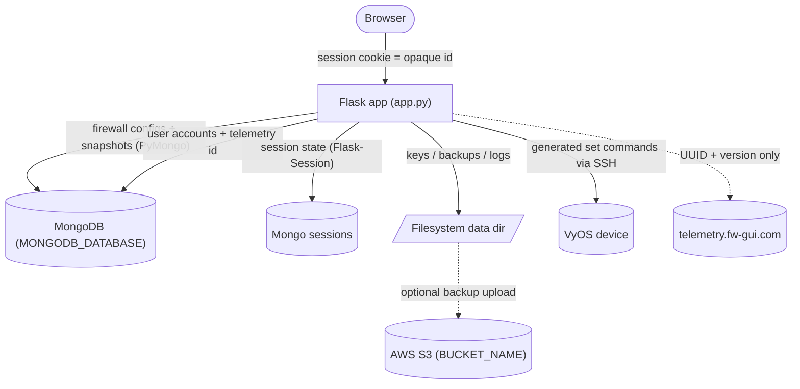
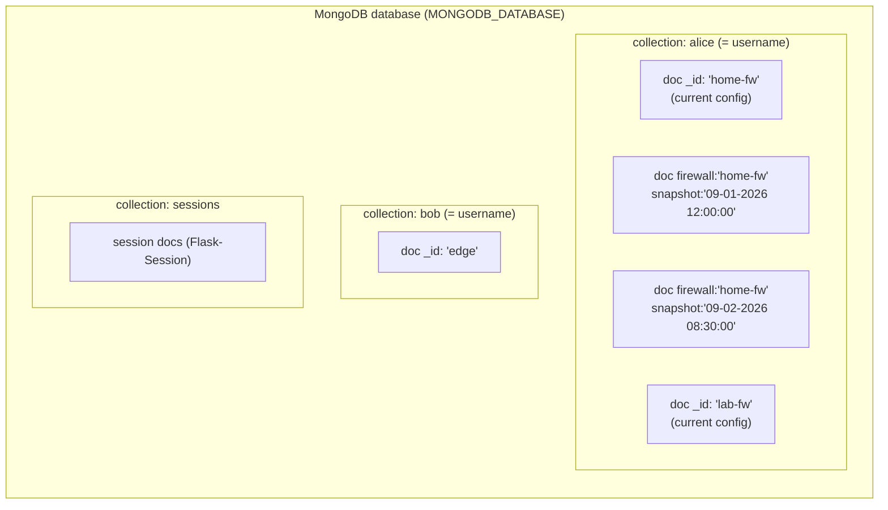
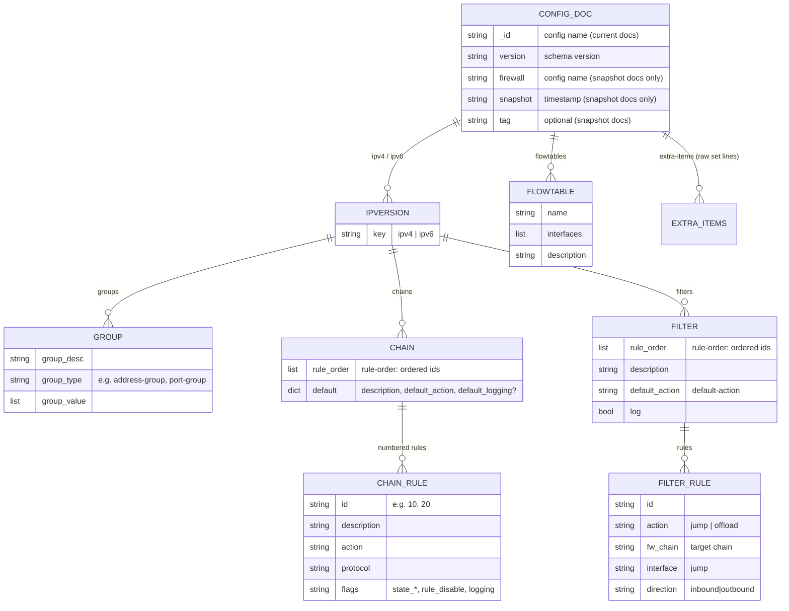
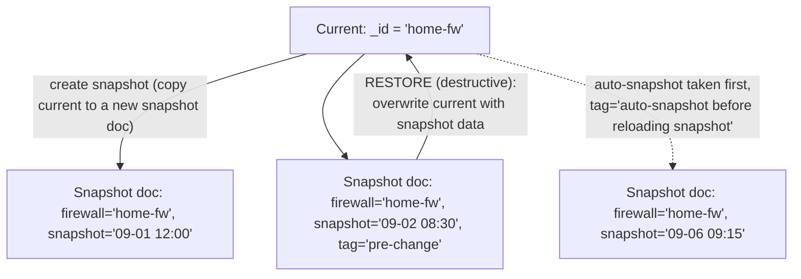
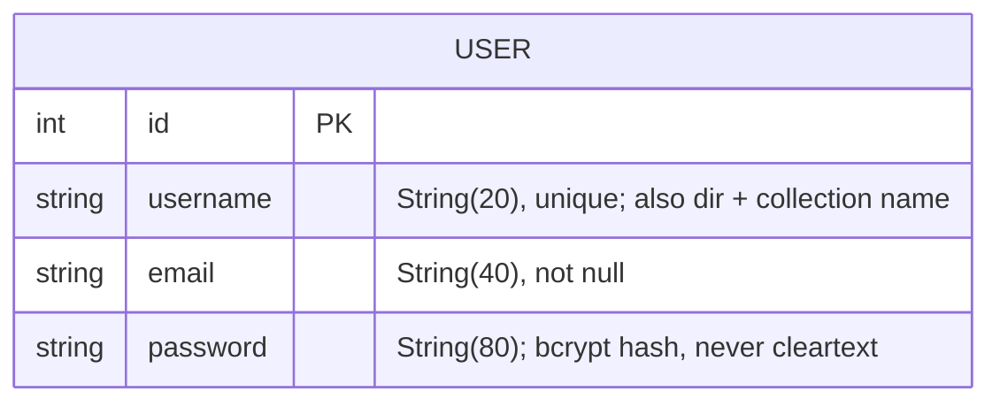
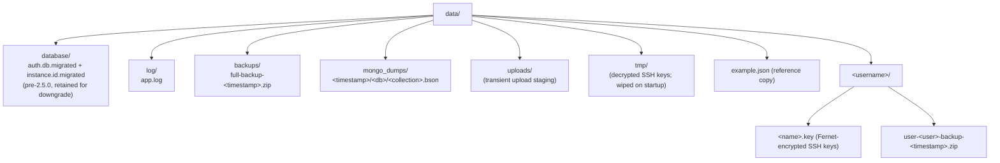
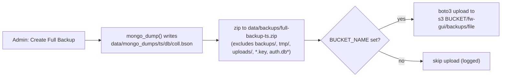
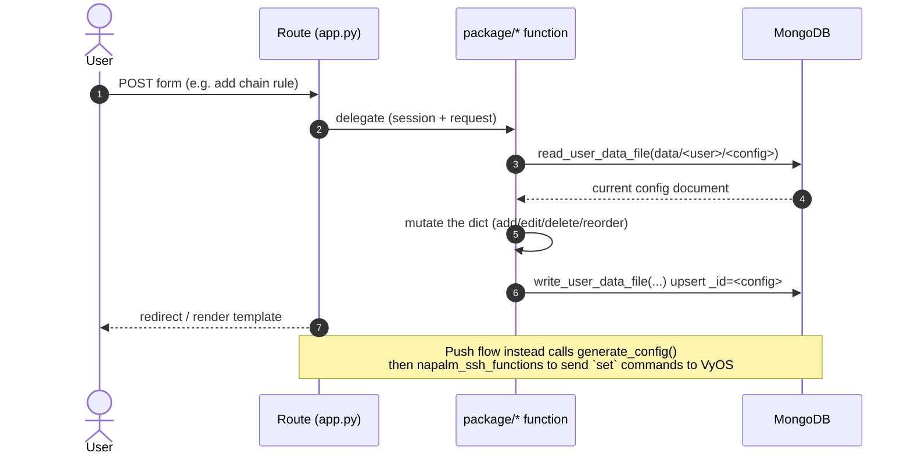

# Data Architecture

How FW-GUI stores and moves data: the databases, the document schema, the
filesystem layout, sessions, backups, and how a request turns into a stored
change. Written for developers and auditors — sections carry `file:line`
references — with diagrams for a quick mental model.

Related: `docs/ssh-credential-handling.md` covers SSH credentials/keys/cookies
in depth; this document covers the overall data model.

**Version note.** Two stores moved into MongoDB in **2.5.0**: user accounts,
previously a SQLite file (`data/database/auth.db`, via Flask-SQLAlchemy), and the
telemetry instance id, previously `data/database/instance.id`. Both eras are
documented — §1, §4 and §10 each carry a `2.5.0+` and a `Pre-2.5.0` subsection —
so this document is usable while running either. Upgrading is automatic and needs
no operator action; see §8 and §10.

---

## 1. Overview

### 2.5.0+

**Two persistent stores**, one of which also backs the server-side session
store:

| Store | Technology | Holds |
|-------|-----------|-------|
| Application DB | **MongoDB** (PyMongo) | All firewall configs + their snapshots (one collection per user), **plus `users` (accounts) and `instance` (telemetry id)** |
| Session store | **MongoDB** (`sessions` collection, via Flask-Session) | Per-session state; browser holds only an opaque id |
| Filesystem (`data/`) | Local volume | Encrypted SSH keys, backups, logs, Mongo dumps |



Configuration data, accounts and the telemetry id are all in MongoDB — the
filesystem holds only keys, generated command files, backups and logs. Those SSH
keys are why the volume is still required.

Consequence worth stating plainly: **MongoDB now holds the credential store.**
The shipped compose files leave MongoDB authentication commented out, justified
by the fact that no port is published and only the fw-gui container shares the
network. Post-2.5.0 anything else attached to that network can read every bcrypt
hash, where previously it would have needed filesystem access inside the fw-gui
container. Enabling MongoDB authentication is correspondingly more worthwhile.

### Pre-2.5.0

**Three persistent stores**, plus a server-side session store:

| Store | Technology | Holds |
|-------|-----------|-------|
| Firewall configuration DB | **MongoDB** (PyMongo) | All firewall configs + their snapshots, one collection per user |
| Auth DB | **SQLite** (Flask-SQLAlchemy) | User accounts (username, email, bcrypt password hash) |
| Session store | **MongoDB** (`sessions` collection, via Flask-Session) | Per-session state; browser holds only an opaque id |
| Filesystem (`data/`) | Local volume | Encrypted SSH keys, generated `.conf` files, backups, logs, Mongo dumps, instance id |


---

## 2. MongoDB — firewall configuration store

### Connection

- Single shared client, lazily created and reused: `_mongo_client` /
  `_get_mongo_client()` → `pymongo.MongoClient(os.environ.get("MONGODB_URI"))`
  (`package/data_file_functions.py:36,72-79`).
- **`serverSelectionTimeoutMS` is 5 s**, not pymongo's 30 s default
  (`SERVER_SELECTION_TIMEOUT_MS`, `:50`), and the Flask-Session client in
  `app.py:236-240` carries the same bound. A database on the same Docker network
  either answers in milliseconds or is not coming, and every stalled request
  holds a waitress thread — a handful of retrying browsers during an outage would
  wedge a finite pool. Measured against a killed MongoDB with the app already
  running: **60.4 s per request before the bound, 10.1 s after** (Flask-Session
  reads on the request and writes on the response, so a request pays the timeout
  twice). `socketTimeoutMS` is deliberately left alone — capping it would kill
  legitimately long queries.
- With `SESSION_TYPE=mongodb` and MongoDB unreachable, `app.py` cannot even be
  imported: Flask-Session's `MongoDBSessionInterface` creates the `expiration` TTL
  index in its constructor. Long-standing behaviour, now surfacing in ~6 s rather
  than ~31 s.
- Database handle from `_get_mongo_db()` (`:69-81`), which every call site uses
  (`:103,378,610,689,762,897,972,1263`). `MONGODB_DATABASE` defaults to
  `DEFAULT_MONGODB_DATABASE` = `"fwgui_database"` (`:40`), matching the
  session-store default at `app.py:240`. The default matters: pymongo raises
  `TypeError: name must be an instance of str` on `client[None]`, and since
  2.5.0 accounts live here too, an unset variable would take the login page down
  rather than only the config routes.
- `validate_mongodb_connection()` (`:1169-1208`) probes at startup and
  `sys.exit()`s on failure, using the same `SERVER_SELECTION_TIMEOUT_MS`. It used
  to pass `serverSelectionTimeoutMS=1`, which is shorter than a real connection
  takes: a mongod that is up but still starting — the normal case behind Compose's
  healthcheck-less `depends_on` — could fail the probe and drop the app into a
  restart loop. In practice the session-store failure above usually fires first.
- No indexes are created by application code. Uniqueness comes from `_id` alone
  (config name per user collection; username in `users`). The TTL index on the
  `sessions` collection is created by Flask-Session, not by this repo.

### Addressing: collection = user, document = config

Throughout the data layer a config is referenced by the string
`data/<username>/<config>[/<snapshot>]`, which is split on `/`:

- `split("/")[1]` → **collection name = username**
- `split("/")[2]` → **document = config (firewall) name**
- `split("/")[3]` (delete only) → **snapshot name**

(`read_user_data_file:790-801`, `write_user_data_file:1093-1116`,
`delete_user_data_file:271-287`.)



- **Current config** = a document whose `_id` is the config name, with **no**
  `firewall`/`snapshot` fields. `list_user_files` finds these with
  `{"firewall": {"$exists": False}, "snapshot": {"$exists": False}}` (`:561-595`).
- **Snapshot** = a separate document in the same collection carrying `firewall`
  (the config name) and `snapshot` (a timestamp string), plus optional `tag`.

### Config document schema

`version` is a schema version (`"0"` legacy → `"1"`; `update_schema:868-929`
renamed legacy `tables`→`chains` and `fw_table`→`fw_chain`). `system` is
auto-added on read if missing (`read_user_data_file:810-815`).



Top-level keys: `version`, `ipv4`, `ipv6`, `flowtables` (list of
`{name, interfaces[], description}`), `extra-items` (list of raw VyOS `set`
strings), `interfaces`, `system` (`{hostname, port}`), and on snapshot docs
`firewall`/`snapshot`/`tag`. Under each `ipv4`/`ipv6`: `groups`, `chains`,
`filters` (identical shape for both IP versions).

**Chain rule** (keyed by id directly under the chain; a full match/action rule):

| Field | Meaning |
|-------|---------|
| `description`, `action`, `protocol` | rule basics |
| `dest_address` + `dest_address_type` | `address` or `*_group` |
| `dest_port` + `dest_port_type` | `port` or `port_group` |
| `source_address`/`source_port` (+ `_type`) | same, source side |
| `state_est` / `state_inv` / `state_new` / `state_rel` | presence flags |
| `rule_disable`, `logging` | presence flags |

**Filter rule** (under `filters[name]["rules"][id]`; a thin dispatch rule):
`description`, `action` (`jump` \| `offload`), `fw_chain` (target chain), and for
`jump`: `interface` + `direction`. Optional flags: `log`, `rule_disable`.

---

## 3. Snapshot model

A snapshot is a **separate document in the same per-user collection**, not a
separate collection or a subfield. Current and snapshots of one config coexist:



- **Create** (`create_snapshot`, called by `app.py select_firewall_config`):
  reads current, writes a new doc keyed `{firewall, snapshot=<timestamp>}`.
  Names have one-second granularity and are the only thing identifying a
  snapshot, so `_unique_snapshot_name` steps the timestamp forward a second at a
  time until the name is unused — otherwise the upsert in `write_user_data_file`
  would silently overwrite a snapshot taken in the same second.
- **List** (`list_snapshots`): `{"firewall": <name>, "snapshot": {"$exists": True}}`,
  projected to `snapshot`/`firewall`/`tag` and sorted by `_id` **ascending**
  (creation order, oldest first). The `MM-DD-YYYY HH:MM:SS` name does not sort
  lexicographically, so the name is not usable as a sort key.
- **Restore** (`restore_snapshot`): reads the snapshot non-destructively, then
  **deletes and rewrites the current document** from it — restore is
  **destructive to current**. `select_firewall_config` triggers this, and first
  calls `create_snapshot(..., AUTO_SNAPSHOT_TAG)` so the working copy about to be
  overwritten survives as a snapshot tagged `auto-snapshot before reloading snapshot`.
  Restores are therefore recoverable: load the auto-snapshot to get back.
- **Delete** (`delete_user_data_file`, via the 4th path segment).
- **Tag** (`set_snapshot_tag`, called by `tag_snapshot` from the
  `POST /snapshot_tag` route): a targeted `update_one` on the snapshot document
  that touches **only** the `tag` field — the configuration data is neither read
  nor rewritten, and there is no `upsert`, so a name that does not resolve is a
  no-op. An empty tag `$unset`s the field; "untagged" is the absence of the key,
  never `""`.
- **Diff** reads a snapshot with `diff=True` so current is untouched
  (`package/diff_functions.py`).

### Snapshot-only keys must never reach a current document

`firewall`, `snapshot` and `tag` exist only on snapshot documents
(`_SNAPSHOT_ONLY_KEYS` in `package/data_file_functions.py`). When
`write_user_data_file` writes a `current` document it pops them from the data
**and** `$unset`s them on the stored document; `$set` alone would leave a key
that had already leaked in place permanently. This matters because
`generate_config` walks the document's top-level keys: a `tag` string sitting
next to `ipv4`/`ipv6` used to be treated as an IP version and crashed config
generation with `TypeError: string indices must be integers`. `generate_config`
now also allow-lists `ipv4`/`ipv6` as a second line of defence.

---

## 4. Authentication store

### 2.5.0+ — MongoDB `users` collection

Accounts live in the collection named by `MONGODB_USERS_COLLECTION` (default
`users`) inside `MONGODB_DATABASE`. Access goes through `package/user_store.py`;
`app.py` has no user model.

```
{"_id":       "alice",              # username — the natural key
 "email":     "alice@example.com",
 "password":  "$2b$12$...",         # bcrypt hash, always str
 "disabled":  false,                # absent means enabled
 "legacy_id": 1,                    # rows migrated from SQLite only
 "created":   ISODate(...)}         # new registrations only
```

**`_id` is the username.** That is load-bearing, not incidental:

- Uniqueness is free. No index is created at startup, so there is no index build
  to fail, and `register_user` does not pre-check the name — `create_user()`
  inserts and `DuplicateKeyError` *is* the duplicate check
  (`auth_functions.py:294-306`). The pre-2.5.0 query-then-insert had a window in
  which two simultaneous registrations of one name could both succeed.
- `_id` matching is binary, which preserves exactly the case-sensitive
  uniqueness the SQLite `unique` column gave: `Bob` and `bob` are distinct. No
  collation is set, deliberately — adding one would change semantics and could
  make an existing pair unmigratable.
- The username is immutable identity. Already true in practice: it is also the
  Mongo collection name and the `data/<username>` directory name, and there is
  no rename feature.

**Reserved usernames.** Because a username is a collection name, `users` and
`sessions` are rejected — hardcoded in `validators.py`
(`_RESERVED_USERNAMES` / `is_reserved_username`), matched lowercased and
stripped, and honoured *in addition to* whatever `MONGODB_USERS_COLLECTION` is
set to. A user holding one of those names would be handed an application
collection as their config collection, and the ordinary config routes would then
let them list, read and delete other users' accounts or session documents.
`is_valid_username()` calls the guard, so every caller inherits it, and the
startup migration refuses to boot if a legacy account already holds such a name.

**Disabling, not deleting.** There is no delete-user feature, by design. Removing
a document would free the username, and the next person to register it would
inherit the previous holder's configs, snapshots and SSH keys. Disable instead:

```javascript
db.users.updateOne({_id: "alice"}, {$set: {disabled: true}})
```

The field is `disabled` rather than `enabled` so that an absent value means
usable — documents predating the field keep working. It is enforced in three
places, because checking only at login would leave an already-authenticated
session alive: `process_login` before `login_user()`
(`auth_functions.py:172-181`), `get_user_by_session_id` used by the `user_loader`
(`user_store.py:83-95`, so disabling takes effect on the user's *next request*),
and `change_password` (`auth_functions.py:84-90`, so a disabled account cannot
rotate its way back in). `User.is_active` returns `not disabled`, which
Flask-Login consults in `login_user()`, as a fourth free layer. A refused login
flashes the same "Login incorrect." as a bad password — saying "disabled" would
hand out account enumeration — and logs a WARNING with the username.

**Session token.** `get_id()` returns `u:<username>`
(`user_store.SESSION_ID_PREFIX`), not the bare name: `is_valid_username` permits
all-digit usernames, so an unprefixed token would be indistinguishable from the
integer primary key that pre-2.5.0 sessions carry, and a stale session holding
`"1"` could resolve to the account *named* `1`.

Passwords are hashed with Flask-Bcrypt and stored as `str` — both write paths
`.decode("utf-8")` the bytes `generate_password_hash()` returns
(`auth_functions.py:97,297`). `_password_matches()` (`:35-49`) traps the
`ValueError` bcrypt raises on an empty or malformed stored hash, so such an
account fails its login instead of 500ing the login page.

Queries deliberately do not swallow exceptions: a MongoDB outage must not be
rendered as "no such user".

### Pre-2.5.0 — SQLite `auth.db` (historical)

`User` model in `app.py`, a Flask-SQLAlchemy + Flask-Login `UserMixin`:



- File: `sqlite:////{db_location}/auth.db` where
  `db_location = os.path.join(os.getcwd(), "data/database")` → `data/database/auth.db`.
  Created via `db.create_all()` if missing, from `initialize_data_dir()`.
- The `password` column holds a **mix of TEXT and BLOB**:
  `generate_password_hash()` returns bytes and neither write path decoded it, so
  what a row contains depends on which code path created it. The 2.5.0 migration
  normalises both to `str`.

After upgrading, the file is retained as `data/database/auth.db.migrated` (see
§8.1). Nothing reads it; it exists only so that downgrading the image still has
accounts. It is excluded from backup zips, since it is a full set of bcrypt
hashes that would otherwise travel to S3.

### Downgrading and re-upgrading

**Procedure.** Stop the app, rename the file back, then start the pre-2.5.0
image:

```bash
docker compose stop fw-gui
mv data/database/auth.db.migrated data/database/auth.db
# switch the image tag back, then
docker compose up -d fw-gui
```

The order matters. Pre-2.5.0 `initialize_data_dir()` runs `db.create_all()` when
`auth.db` is absent, so starting the old image first leaves you with an empty
database — no accounts and an open registration page — which then has to be
overwritten and the container restarted.

**What the downgrade costs.** `auth.db.migrated` is a point-in-time snapshot
taken at the cutover, and the old code knows nothing about the fields 2.5.0
added:

- **Disabled accounts become active again.** Pre-2.5.0 has no `disabled`
  concept and never reads the field, so anyone disabled in 2.5.0 regains access.
- Accounts created after the cutover are **not in the file at all** — those users
  lose access entirely.
- Passwords changed after the cutover **revert to their pre-cutover value**,
  including one rotated precisely because it leaked.
- Everyone is logged out once. Sessions hold `_user_id = "u:<username>"`, which
  matches no integer primary key, so the old `load_user` returns `None` and the
  request is redirected to the login page. Not an error, just a re-login.
- `POST /download` comes back (§6).

Firewall configs and snapshots are unaffected — the authentication move did not
touch their documents, so the old image reads exactly the same data.

**Re-upgrading afterwards needs a decision.** The `users` collection stays in
MongoDB for the whole downgraded period, and the migration's `$setOnInsert`
(§8.1) means an existing MongoDB document always wins. So a plain re-upgrade
**keeps the MongoDB state and discards everything changed while downgraded** —
password changes and disables included; only users who are genuinely new to
MongoDB get inserted. The migration logs a WARNING naming every account it
skipped for this reason, which on a first-ever migration never appears.

That default is deliberate: quietly overwriting live accounts from a stale
SQLite file would be the worse mistake. To re-upgrade from the SQLite state
instead, drop the collection first so the migration repopulates it from scratch:

```javascript
db.users.drop()
```

Be clear about what that costs, though — it makes SQLite the whole truth, so it
reintroduces the downgrade's own losses: **every account created after the
original cutover disappears** (they were only ever in MongoDB), and **every
disabled account is enabled again** (SQLite has no such field). Prefer it only
when the changes made while downgraded outweigh those.

**Where the rollback data lives: the volume, not a backup.** Full-backup zips
taken after the cutover exclude `auth.db*` and carry `mongo_dumps/.../users.bson`
instead, so they cannot serve a downgrade. If the volume's `auth.db.migrated` is
gone, there is no rollback path.

**Rename `instance.id.migrated` back too.** 2.5.0 also moved the telemetry
instance id into MongoDB (§10) and retired `data/database/instance.id` the same
way. A downgrade that leaves the file renamed will have the old code mint a fresh
UUID, so the install reports to telemetry as a brand new one. Harmless to the
application either way, but it breaks continuity in the maintainer's counts:

```bash
mv data/database/instance.id.migrated data/database/instance.id
```

---

## 5. Session store

Flask-Session stores session state **server-side**; the browser cookie holds
only an opaque, signed session id (`app.py:221-245`).

- `SESSION_TYPE` (env, default `mongodb`) → collection `sessions` in the same
  Mongo database (`SESSION_MONGODB*`). Tests use `filesystem`.
- Keys: `data_dir`, `username`, `firewall_name`, `hostname`, `port`, `ssh_user`,
  `ssh_pass` (**Fernet-encrypted at rest**, `encrypt_secret`/`decrypt_secret`,
  `app.py:248-274`), `ssh_keyname`, `_user_id`.
- `_user_id` is Flask-Login's token. **2.5.0+:** `u:<username>`. **Pre-2.5.0:**
  the SQLite integer primary key as a string. The formats are disjoint on
  purpose (§4).
- Cookie hardening: `HTTPONLY=True`, `SAMESITE=Lax`, `SECURE` opt-in via env.
- Lifetime: `SESSION_PERMANENT=True` honoring `PERMANENT_SESSION_LIFETIME`
  (from `SESSION_TIMEOUT`, default 120 min). Logout deletes the session doc; a
  TTL index on `expiration` reaps expired ones. (Details in
  `docs/ssh-credential-handling.md`.)
- **The 2.5.0 upgrade clears the session store once** — every document in the
  `sessions` collection and every file in `flask_session/` — because the
  `_user_id` format changed. Everyone is logged out at the cutover instead of
  holding a token that cannot resolve.

---

## 6. Filesystem layout (`data/`)

Created by `initialize_data_dir()` (`data_file_functions.py:484-554`):



- Per-user dir `data/<username>/` created on first login (`auth_functions.py:218-233`);
  path stored in the session as `data_dir`.
- `data/tmp/` is cleared on every startup (`:539-543`); it stages decrypted SSH
  keys per-operation (see the SSH doc).
- Nothing in the app serves arbitrary files out of `data/`. The `POST /download`
  route, which read any path under `data/` for any logged-in user, was removed
  in 2.5.0; it had no caller in the UI. The two real download endpoints,
  `/download_config` and `/download_json`, build their response from the
  session's own config and take no caller-supplied path.
- **Neither firewall config data, user accounts, nor the telemetry id are here**
  — all three are in MongoDB as of 2.5.0. The per-user dir holds only keys and
  user backup zips; `database/` holds nothing that current code writes, only the
  retained `auth.db.migrated` and `instance.id.migrated` on an upgraded install.
- Pre-2.5.0 the per-user dir also held a generated `<firewall_name>.conf` per
  config: the set commands, written on every push purely to give NAPALM a file
  path, and never deleted. NAPALM is now handed the commands as a string
  (`build_merge_config`), so the files are no longer written, and
  `sweep_legacy_conf_files()` (`:557-599`) removes the leftovers on the first
  startup after upgrade.

---

## 7. Backups



- `create_backup(session, user=False)` (`data_file_functions.py:206-270`): runs
  `mongo_dump()` (`:731-770`), zips `data/` **excluding** `backups/`, `tmp/`,
  `uploads/`, any `*.key`, and `auth.db*` (`:237-250`), then
  `upload_backup_file()`.
- `mongo_dump()` sweeps `list_collection_names()`, so since 2.5.0 every dump
  includes `users.bson` — the full bcrypt hash set. That is intentional: a backup
  without accounts would be of limited use. It is also why the retained
  pre-2.5.0 `auth.db*` is excluded (a second, redundant copy of the same
  secrets) and why the `POST /download` route was removed (§6): the zips were
  in-app readable by any logged-in user. Dumps are timestamped and never pruned,
  so the number of copies on the volume grows with each backup.
- S3 (`upload_backup_file:932-992`): env `BUCKET_NAME`, `AWS_ACCESS_KEY_ID`,
  `AWS_SECRET_ACCESS_KEY`; skipped if `BUCKET_NAME` unset; key prefix
  `fw-gui/backups/`.
- **No in-app restore**: backups are created/uploaded/listed only. Retrieving a
  backup zip is an out-of-band operation (filesystem or S3) — as of 2.5.0 there
  is no in-app download for it — and there is no automated restore path in the
  code.

---

## 8. Startup migrations

Both run from `app.py`'s `__main__` block after the MongoDB connection check,
users first — `mongo_converter()` takes its user list from the `users`
collection, so the accounts have to be there already:

```python
if validate_mongodb_connection(os.environ.get("MONGODB_URI")):
    migrate_sqlite_users()
    mongo_converter()
```

### 8.1 SQLite accounts → MongoDB (`user_migration.py`, 2.5.0)

No operator action required.

1. Return immediately if `data/database/auth.db` is absent — a fresh install, or
   one already migrated.
2. Abort (CRITICAL + exit) if the target collection already holds documents with
   no `password` field: it is some user's config collection, and
   `MONGODB_USERS_COLLECTION` needs to point somewhere else.
3. Read the accounts from SQLite over a read-only `file:` URI (so no `-wal`
   /`-shm` sidecars appear beside a database the app otherwise no longer opens),
   querying `FROM user` — SQLAlchemy's implicit table name. An unreadable or
   corrupt file is logged and skipped **without** renaming, so the next boot
   retries.
4. Abort (CRITICAL + exit) if any legacy username is reserved (§4). The operator
   has to rename the account.
5. For each row, normalise the hash to `str` (the column holds a TEXT/BLOB mix)
   and upsert with **`$setOnInsert`**. Rows with no username or no password are
   skipped with a warning.
6. Purge the session store (§5).
7. Rename `auth.db` → `auth.db.migrated`. An existing `auth.db.migrated` is never
   overwritten — it is an earlier migration's rollback snapshot — so the new one
   gets a timestamp suffix instead.

**Why `$setOnInsert` and not `$set`.** The rename is the marker, and a marker on
a volume is not trustworthy: restore `data/` from an older snapshot and the
migration runs again. With `$set` that re-run would restore every user's
pre-cutover password hash — including one deliberately rotated because it
leaked — and re-enable an account the operator had since disabled. With
`$setOnInsert` a second run is a no-op on accounts that already exist.

`process_login()` also calls `migrate_sqlite_users()`, guarded by the same
missing-file check. `app.py` is the shipped entrypoint, but a WSGI server
(`gunicorn app:app`) never runs its `__main__` block, and every account would
appear to have vanished.

To re-run deliberately, rename `auth.db.migrated` back to `auth.db` and restart.
Note what a re-run does **not** do: accounts already present in MongoDB are left
exactly as they are (that is `$setOnInsert`), so this recovers accounts that
failed to migrate rather than re-syncing the ones that succeeded. See
"Downgrading and re-upgrading" in §4.

### 8.2 On-disk JSON configs → MongoDB (`mongo_converter.py`, 1.4.0)

One-shot startup migration of pre-1.4.0 on-disk JSON configs:

1. Get the user list from `user_store.list_usernames()` (disabled accounts
   included, so their leftover JSON still imports). Pre-2.5.0 this was
   `SELECT username FROM User` against `auth.db`.
2. For each user, find `data/<user>/*.json`.
3. `json.loads` each, drop `_id`, `write_user_data_file(...)` (inserts a current
   config doc).
4. Rename the file to `<name>.old` so it isn't re-imported.

No-op when no leftover `.json` files exist. Uploaded JSON takes the same
`write_user_data_file` path via `process_upload`.

It walks per-user directories rather than globbing `data/*/*.json` on purpose:
the glob would match `data/uploads/*.json`, the transient upload staging area,
and import a stray upload into a collection named `uploads`.

---

## 9. Request → storage data flow



Matches the documented flow in `CLAUDE.md`: HTTP → route → package function →
`read_user_data_file` → mutate → `write_user_data_file` → render/redirect.

---

## 10. Telemetry

Sends **only** an instance UUID and the app version to
`https://telemetry.fw-gui.com/<route>` (`/instance`, `/commit`, `/diff`,
`/rule_usage`) via urllib3 (`telemetry_functions.py`). No config or user data is
transmitted, and every failure is swallowed.

### 2.5.0+ — the `instance` collection

`package/instance_id.py` owns the id. One document, in the collection named by
`validators.INSTANCE_COLLECTION`:

```
{"_id": "instance_id", "value": "<uuid4>", "created": ISODate(...)}
```

`get_or_create_instance_id()` resolves in order:

1. **`FWGUI_INSTANCE_ID`**, if set — returned immediately, without touching
   MongoDB. Used by CI to tag its runs, and available to pin one identity across
   a blue/green replacement.
2. **A process-level cache.** `get_instance_id()` fires on every telemetry event
   — login, commit, diff, rule usage — and used to be a free file read; without
   the cache each event would be a round trip. Only a non-empty value is cached,
   so a transient outage does not pin `""` for the life of the process.
3. **MongoDB**, seeded lazily on first use with `$setOnInsert` + a read-back, so
   two concurrent callers converge on one value rather than racing.

Seeding lives in the getter rather than in `initialize_data_dir()` on purpose: it
removes any startup-ordering coupling and works under a WSGI entrypoint that
never runs `app.py`'s `__main__`.

`instance` is a reserved username (§4) — a username is also a collection name, so
otherwise a user could be handed this collection as their config collection. The
collision is *not* auth-critical, so unlike `users`/`sessions` it does not abort
the startup migration; `instance_id.py` logs an ERROR and telemetry degrades.

**Two invariants, both mutation-tested:**

- **Nothing in `instance_id.py` raises.** `telemetry_commit()` and
  `telemetry_diff()` are called from `napalm_ssh_functions.py:128` and `:199`
  *outside* the try blocks that guard a firewall push, so an escaping exception
  would turn a telemetry lookup into a failed commit. An unavailable id is `""`.
- **The lookup is time-bounded** by `pymongo.timeout(2.0)`, tighter than the
  shared client's 5 s (§2) because this used to be a free file read and
  `telemetry_instance()` is in the login path. Four telemetry calls against an
  unreachable database measured 121 s against pymongo's bare 30 s default, 8 s
  with the bound.

`telemetry_instance()` runs *after* `validate_mongodb_connection()` in `app.py`'s
`__main__`, so it has a real id and cannot stall the boot. Consequence: an install
that cannot reach MongoDB used to post here and then exit, so it reported; it now
dies silently.

### Pre-2.5.0 — `data/database/instance.id`

A random `uuid.uuid4()` written once by `initialize_data_dir()` and read back with
a plain `open()`. On upgrade the value is **adopted** so the install keeps its
telemetry identity, then the file is renamed to `instance.id.migrated` — retained
for the same reason as `auth.db.migrated`, and cleaned up with it. Retiring the
file is best effort: the id is already stored and the stored value wins on every
later read, so a read-only data directory costs a leftover file, not the id.

---

## 11. Data-related environment variables

| Variable | Purpose |
|----------|---------|
| `MONGODB_URI` | MongoDB connection string (configs, accounts, sessions) |
| `MONGODB_DATABASE` | Mongo database name (default `fwgui_database`) |
| `MONGODB_USERS_COLLECTION` | Collection holding user accounts (default `users`, 2.5.0+). Escape hatch for an install that already has a user of that name |
| `FWGUI_INSTANCE_ID` | Pins the telemetry instance id instead of reading it from MongoDB (2.5.0+). Unset for normal use |
| `APP_SECRET_KEY` | Signs the session id; derives the cached-secret encryption key |
| `SESSION_TYPE` | Session backend (`mongodb` default; `filesystem` for tests) |
| `SESSION_TIMEOUT` | Session lifetime in minutes (default 120) |
| `SESSION_COOKIE_SECURE` | Send session cookie over HTTPS only (opt-in) |
| `BUCKET_NAME`, `AWS_ACCESS_KEY_ID`, `AWS_SECRET_ACCESS_KEY` | Optional S3 backup upload |
