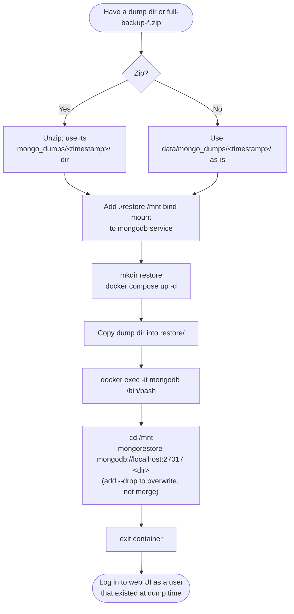

# MongoDB Restore Procedure

How to restore an FW-GUI MongoDB dump (from `data/mongo_dumps/` or extracted
from a `full-backup-*.zip`) into a running `mongodb` container.

Dump layout produced by `mongo_dump()` (`package/data_file_functions.py`):

```
data/mongo_dumps/<timestamp>/<database_name>/<collection>.bson
```

`<database_name>` defaults to `fwgui_database` (`MONGODB_DATABASE` env var).
A `full-backup-*.zip` contains this same `mongo_dumps/<timestamp>/` tree
alongside the rest of `data/` — unzip it first and use that subdirectory as
the dump dir below.



## Procedure

1. In the directory with your `docker-compose.yml`, add a bind mount to the
   `mongodb` service:

   ```diff
     mongodb:
       volumes:
         - mongo-data:/data/db
         - mongo-config:/data/configdb
   +     - ./restore:/mnt
   ```

2. Create the local restore directory:

   ```bash
   mkdir restore
   ```

3. Bring the stack up:

   ```bash
   docker compose up -d
   ```

4. Place the dump directory in `restore/`, e.g.
   `restore/2026-09-15-15:37:39.847064/fwgui_database/*.bson`.

5. Shell into the container:

   ```bash
   docker exec -it mongodb /bin/bash
   ```

6. Inside the container, run the restore:

   ```bash
   cd /mnt
   mongorestore mongodb://localhost:27017 2026-09-15-15:37:39.847064
   ```

   Expect a `restoring ...` line per collection, then `X document(s) restored
   successfully`.

7. Exit the container and log in via the web UI with an account that existed
   when the dump was taken.

## Notes

- **This is a merge, not an overwrite.** Plain `mongorestore` upserts by
  `_id` and does not touch collections/documents absent from the dump — stale
  data written after the dump stays. To fully replace a collection's contents
  with the dump instead, add `--drop` (drops each collection just before
  restoring it):

  ```bash
  mongorestore --drop mongodb://localhost:27017 2026-09-15-15:37:39.847064
  ```

- Restoring `users`, `keys`, or `instance` reverts accounts, encrypted SSH
  keys, and the telemetry id / backup schedule to their state at dump time.
- Encrypted SSH key ciphertext restores fine, but the Fernet key that
  decrypts it was only ever shown to the user once and is never stored — a
  key uploaded after the dump is unrecoverable regardless of `--drop`.
- If `MONGODB_DATABASE` is not the default `fwgui_database`, the subdirectory
  under the timestamp dir will be named accordingly; no other step changes.
- Revert the `./restore:/mnt` bind mount once done — it is not needed for
  normal operation.
