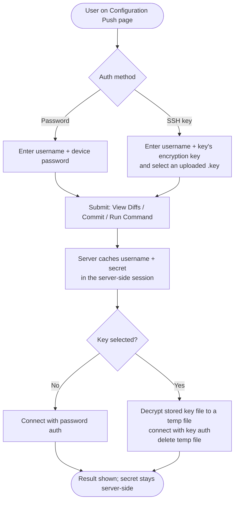
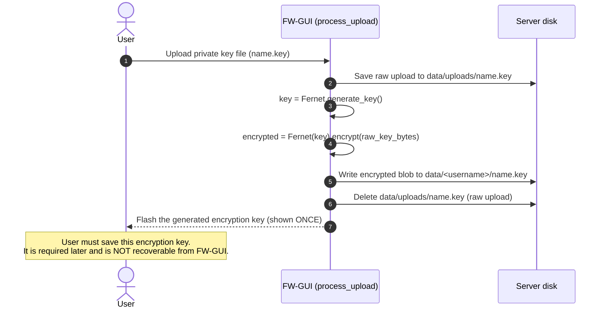
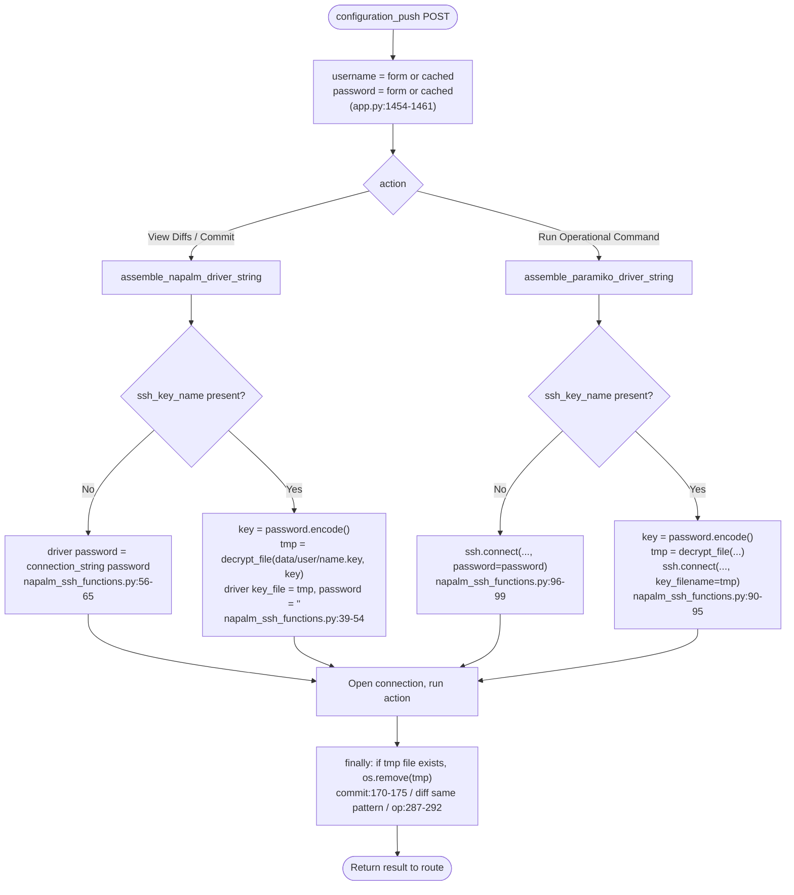
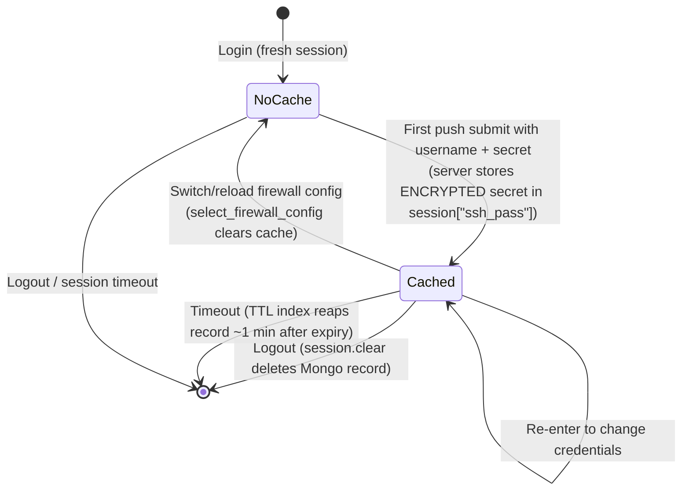
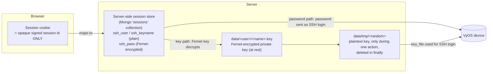

# SSH, Password, Key & Cookie Handling

How FW-GUI connects to VyOS firewall instances over SSH, and exactly how it
stores, uses, and disposes of the credentials involved.

This document is written for two audiences:

- **End users / operators** — the "How it works" and "Lifecycle at a glance"
  sections and the first diagram explain what happens to your password and keys
  in plain terms.
- **Developers / auditors** — every section carries file/function references and
  the remaining sections give the full data-at-rest, logging, and threat detail.

---

## 1. Overview for end users

FW-GUI talks to a VyOS device only when you use the **Configuration Push** page
to *View Diffs*, *Commit*, or *Run an Operational Command*. Two authentication
methods are supported:

| Method | What you enter | What actually authenticates to the device |
|--------|----------------|--------------------------------------------|
| **Password auth** | SSH username + SSH password | The password is sent to the device as the SSH login password. |
| **SSH key auth** | SSH username + the **encryption key** for a previously-uploaded key file | FW-GUI decrypts your stored private key with that encryption key and logs in with the key. The device never receives the encryption key. |

Important detail: **the "Password" field is dual-purpose.** When you select
password auth it is your device password; when you select an uploaded SSH key it
is the *encryption key* (a Fernet key) that unlocks the stored private key. In
both cases FW-GUI treats it as a high-value secret.

For convenience, once you enter credentials while logged in, FW-GUI remembers
them **on the server** for the rest of your session, so you can run several
actions without re-typing. The secret is never placed in your browser and never
rendered back into the page.

---

## 2. Where the pieces live in code

| Concern | Location |
|---------|----------|
| Push page route (build connection, cache creds, render) | `app.py` → `configuration_push()` (~`app.py:1418`) |
| Session backend configuration | `app.py:195-208` (Flask-Session) |
| Session lifetime | `app.py:169-183` (`SESSION_TIMEOUT` → `PERMANENT_SESSION_LIFETIME`, `SESSION_PERMANENT`) |
| Cached-secret encryption helpers | `app.py` → `_session_fernet()` / `encrypt_secret()` / `decrypt_secret()` (after `Session(app)`) |
| Logout (clears + deletes session record) | `app.py` → `user_logout()` (`:457`) |
| NAPALM driver assembly (View Diffs / Commit) | `package/napalm_ssh_functions.py` → `assemble_napalm_driver_string()` (`:25`) |
| Paramiko client assembly (Run Command) | `package/napalm_ssh_functions.py` → `assemble_paramiko_driver_string()` (`:68`) |
| Commit / diff / operational actions | `commit_to_firewall()` (`:107`), `get_diffs_from_firewall()` (`:178`), `run_operational_command()` (`:239`) |
| TCP reachability check | `test_connection()` (`:295`) |
| Key upload + encryption | `package/data_file_functions.py` → `process_upload()` (`:697`) |
| Key decryption (temp staging) | `package/data_file_functions.py` → `decrypt_file()` (`:202`) |
| List uploaded keys | `package/data_file_functions.py` → `list_user_keys()` (`:597`) |
| Push form template | `templates/configuration_push.html` |

---

## 3. SSH key upload and encryption

When a user uploads a private key file (must end in `.key`), FW-GUI encrypts it
at rest with a freshly generated **Fernet** symmetric key and hands that key to
the user *once*. The plaintext key is never stored.

Reference: `process_upload()` in `package/data_file_functions.py:728-756`.

Key facts for auditors:

- **Encryption:** `cryptography.fernet` (AES-128-CBC + HMAC-SHA256). Symmetric.
- **The generated Fernet key is displayed to the user once** (`flash(..., "key")`,
  `data_file_functions.py:746-749`) and is **not** persisted by FW-GUI. Losing it
  means the stored key file cannot be decrypted — the user must re-upload.
- **Storage location:** the encrypted key lives at
  `data/<username>/<name>.key` (per-user directory).
- Key files are **excluded from user backups** (`.key` skipped in
  `create_backup()`, `data_file_functions.py:186`).
- `# TODO -- validate key is a valid ssh key` (`:730`) — uploaded content is not
  yet validated as a real SSH key.

---

## 4. Connecting to a firewall (both auth paths)

The Configuration Push route builds a `connection_string` dict and calls one of
the driver-assembly helpers. For **key auth**, the encrypted key file is
decrypted to a short-lived temp file, used, then removed in a `finally` block.

### Temporary decrypted-key lifecycle

`decrypt_file()` (`data_file_functions.py:202-245`):

1. `Fernet(key)` where `key = connection_string["password"].encode("utf-8")`.
2. Reads `data/<username>/<name>.key`, decrypts it.
3. Writes the **plaintext** private key to `data/tmp/<6 random chars>`
   (name from the non-cryptographic `random` module — see Threats).
4. Returns that path; NAPALM/Paramiko use it as `key_file` / `key_filename`.
5. The caller deletes it in a `finally` block:
   - `commit_to_firewall()` → `napalm_ssh_functions.py:170-175`
   - `get_diffs_from_firewall()` → `finally` block in the same pattern
   - `run_operational_command()` → `napalm_ssh_functions.py:287-292`
6. If driver assembly itself raises before a temp file is created, `tmpfile`
   is `None` and cleanup is correctly skipped.

### Host key policy

`assemble_paramiko_driver_string()` sets
`paramiko.AutoAddPolicy()` (`napalm_ssh_functions.py:81`) — unknown host keys are
trusted automatically. This is intentional today (marked `# nosec B507`) but is
a MITM exposure; see Threats.

### Operational command execution

`run_operational_command()` wraps the user-supplied `op_command` into a VyOS
`vbash` script and runs it over the Paramiko channel
(`napalm_ssh_functions.py:258-267`). The command string is not currently
allowlisted; see Threats.

---

## 5. Session, cookie & credential caching lifecycle

FW-GUI uses **server-side sessions** (Flask-Session). The browser cookie holds
only an opaque, signed **session id**; all session contents — including the
cached SSH username and secret — are stored server-side.

Backend configuration (`app.py:195-208`):

- `SESSION_TYPE` (env, default `"mongodb"`) selects the backend. With `mongodb`,
  session documents are stored in the existing MongoDB database in a `sessions`
  collection (`SESSION_MONGODB*`). Tests set `SESSION_TYPE=filesystem` for
  offline runs.
- `SESSION_PERMANENT = True` makes sessions honor
  `PERMANENT_SESSION_LIFETIME`, which is derived from the `SESSION_TIMEOUT` env
  var (minutes, default 120) at `app.py:169-183`.
- The session cookie / id is signed with `APP_SECRET_KEY`.

### What is cached and when

In `configuration_push()` (POST):

- Credentials are resolved **freshly-typed first, else cached**
  (`app.py:1454-1461`):
  `username = request.form.get("username") or session.get("ssh_user", "")` and
  the same for `password`. An empty password field therefore means "reuse the
  credential cached this session."
- The resolved values are written back to `session["ssh_user"]` /
  `session["ssh_pass"]`, and `session["ssh_keyname"]` when a key is chosen. The
  password/Fernet key is **encrypted before storage** via `encrypt_secret()` and
  decrypted with `decrypt_secret()` on read, so it is not held in cleartext in
  the session store (see §10).
- **The secret is never rendered back to the browser.** The template receives
  only `ssh_pass_cached` (a boolean) and `ssh_user_name`; the password input has
  no `value=` and is `required` only when nothing is cached
  (`templates/configuration_push.html`).

### When the cache is cleared

- On switching / (re)loading a firewall config, `select_firewall_config()`
  resets `session["ssh_user"] = ""`, `session["ssh_pass"] = ""`,
  `session["ssh_keyname"] = ""` (`app.py:1858-1860`).
- **Explicit logout** (`user_logout()`, `app.py:457-484`) calls `logout_user()`
  then `session.clear()`. Emptying a modified session causes Flask-Session's
  `save_session` to **delete the server-side record** (the Mongo `sessions`
  document) and expire the cookie — so the cached secret is actively removed on
  logout, not merely blanked.
- **Session timeout** (idle past `SESSION_TIMEOUT`) is different: no logout
  request runs, so the document persists until it expires. Flask-Session's
  MongoDB backend writes an `expiration` datetime on every save and creates a
  **TTL index** on that field at startup (`flask_session/mongodb/mongodb.py:68`),
  so MongoDB automatically deletes expired session documents (its TTL monitor
  runs about once per minute). Net effect: explicit logout deletes the row
  immediately; timeout deletes it automatically shortly after expiry via the TTL
  index. Because the cached secret is encrypted (see §10), a document lingering
  briefly before reaping does not expose the cleartext secret.
- Note: logout/timeout does **not** touch the encrypted `.key` file at rest
  (persists by design) or `data/tmp/` (decrypted keys are deleted per-action in
  the action `finally` blocks, not at logout).

### Where each secret actually resides

---

## 6. Lifecycle at a glance

| Secret | Created / entered | Stored where | Sent to device? | Destroyed |
|--------|-------------------|--------------|-----------------|-----------|
| Device SSH password | User types on push form | Server-side session (`ssh_pass`), **Fernet-encrypted at rest** | Yes, as SSH login password | On config switch, logout, or session timeout |
| Fernet encryption key (for uploaded key) | Generated at upload, shown once | **Not stored** by FW-GUI; user keeps it. Cached in server-side session (`ssh_pass`) **encrypted** after entry, for the session | No | Cache cleared on config switch / logout / timeout |
| Encrypted private key file | Encrypted at upload | `data/<username>/<name>.key` (Fernet-encrypted, at rest) | No (only its decrypted form is used) | Deleted only if the user deletes the key |
| Decrypted private key (temp) | Per action, by `decrypt_file()` | `data/tmp/<random>` (plaintext) | Used as `key_file` for the SSH login | Removed in the action's `finally` block |
| Session id | On login | Signed cookie in browser | No | Cookie expiry / logout / timeout |

---

## 7. Logging behavior

- `assemble_paramiko_driver_string()` logs the connection parameters at DEBUG
  with the `password` key **removed** (`napalm_ssh_functions.py:88`), so the
  password / Fernet key is not written to `data/log/app.log`.
- `decrypt_file()` logs the temp file *path* (not contents) at DEBUG
  (`data_file_functions.py:242`).
- `run_operational_command()` logs the operational command text and its output
  at INFO/DEBUG (`napalm_ssh_functions.py:257,276`).
- Note (tracked separately): several route handlers still log the entire
  `request.form` at debug/info elsewhere in the app; those forms are not on the
  SSH path but are a general log-hygiene item.

---

## 8. Threats & residual risks

| # | Risk | Status |
|---|------|--------|
| 1 | Secret in **client cookie** (readable) | **Mitigated** — sessions are server-side; cookie holds only an opaque id. |
| 2 | Secret **echoed into HTML** `value=` | **Mitigated** — password input is never prefilled; template gets only a boolean. |
| 3 | Secret in logs | **Mitigated** on the SSH path — password stripped before logging. |
| 4 | Cached secret at rest in the Mongo `sessions` collection | **Mitigated** — the cached secret is Fernet-encrypted before storage (§10). Residual: the derivation key comes from `APP_SECRET_KEY`, so a host/app compromise that exposes that key defeats it; still lock down DB access. |
| 5 | `paramiko.AutoAddPolicy()` trusts unknown host keys | **Residual** — MITM exposure; intentional today. Consider `RejectPolicy` + known-hosts. |
| 6 | `run_operational_command()` sends arbitrary `op_command` to the device with no allowlist | **Residual** — authenticated users can run any operational command. |
| 7 | `decrypt_file()` writes the plaintext key to `data/tmp/` with a non-crypto random name and default permissions; a crash before the `finally` could leave it on disk | **Residual** — prefer `tempfile.mkstemp(0o600)` or in-memory key loading. |
| 8 | Uploaded `.key` content is not validated as a real SSH key | **Residual** — see `# TODO` at `data_file_functions.py:730`. |

---

## 9. Operator notes

- Set a unique `APP_SECRET_KEY` — it signs the session id **and** derives the key
  that encrypts the cached SSH secret (§10). See the inline comments in `.env` /
  compose files / Helm values.
- With `SESSION_TYPE=mongodb` (default), still restrict MongoDB access. The
  cached SSH secret is encrypted at rest, but everything else in the session
  (username, firewall name) is not, and defense-in-depth matters.
- The Fernet encryption key shown after a key upload is displayed **once** and is
  not recoverable — users must record it to use key auth later.

---

## 10. Encryption of the cached secret at rest

The cached SSH secret (device password, or the Fernet key that unlocks an
uploaded private key) is **encrypted before it is written to the session store**
and decrypted only when needed to build a connection. This protects it against
read access to the session backend (e.g. the Mongo `sessions` collection).

### How it works (implemented)

Application-level field encryption in `app.py`:

- `_session_fernet()` builds a `Fernet` from a key **derived from
  `APP_SECRET_KEY`**: `base64.urlsafe_b64encode(sha256(APP_SECRET_KEY))`. The
  encryption key is never stored — it is recomputed from the app secret.
- `encrypt_secret(value)` / `decrypt_secret(token)` wrap the value. Empty stays
  empty; `decrypt_secret` returns `""` on any failure (e.g. after
  `APP_SECRET_KEY` rotation) rather than raising.
- In `configuration_push()`: the secret is stored as
  `session["ssh_pass"] = encrypt_secret(password)` and read back as
  `decrypt_secret(session.get("ssh_pass", ""))`. `ssh_user` and `ssh_keyname`
  remain plaintext (not sensitive).

Consequences:

- The `val` blob of the Mongo session document contains only the **ciphertext**
  of the SSH secret; a database dump does not reveal it.
- Rotating `APP_SECRET_KEY` invalidates cached secrets (they fail to decrypt and
  fall back to `""`, so the user simply re-enters). This is acceptable —
  cached secrets are session-scoped.
- **Threat boundary:** this defends against *DB-at-rest / DB-read* exposure. It
  does **not** defend against a compromise of the app host/process, since the
  derivation key comes from `APP_SECRET_KEY` available there.

### Expiry / reaping

Flask-Session's MongoDB backend creates a **TTL index** on the `expiration`
field at startup (`flask_session/mongodb/mongodb.py:68`), so MongoDB
automatically deletes expired session documents (TTL monitor runs ~once/minute).
No manual index is required.

### Alternatives (not implemented)

If a stronger boundary is later required:

| Option | Protects against | Cost |
|--------|------------------|------|
| Infra: MongoDB Enterprise/Atlas encrypted storage engine | Stolen disk (transparent) | Enterprise/Atlas only; not community `mongo` |
| Infra: volume/disk encryption (LUKS, cloud disk) under Mongo data dir | Stolen disk | Ops-only, no app change; does **not** stop DB-read access |
| App: whole-session encryption via a custom `MongoDBSessionInterface` subclass | DB-read access, for all session fields | Couples to Flask-Session internals |
| App: dedicated `SESSION_ENC_KEY` env var instead of deriving from `APP_SECRET_KEY` | Decouples secret rotation; key not tied to session signing | One more secret to manage |
| MongoDB CSFLE / Queryable Encryption | DB-read access, with KMS-managed keys | Requires KMS + `libmongocrypt`; heavy for session blobs |
